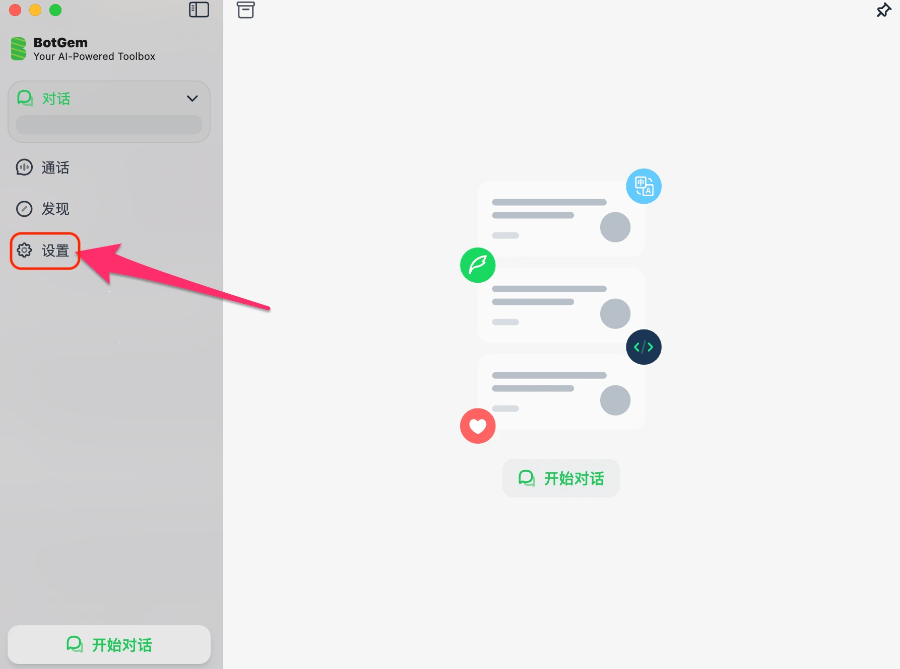
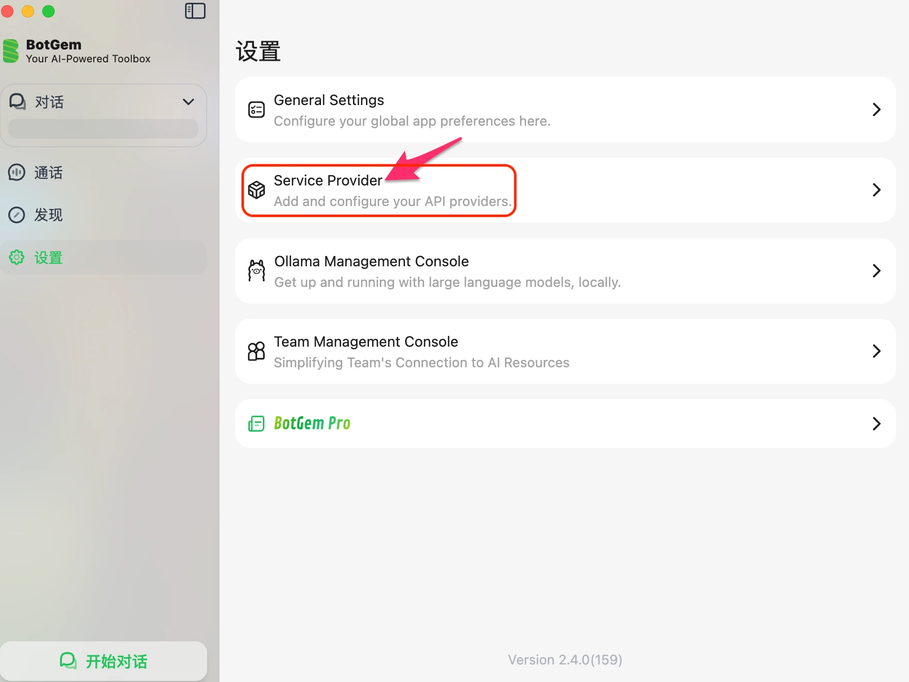
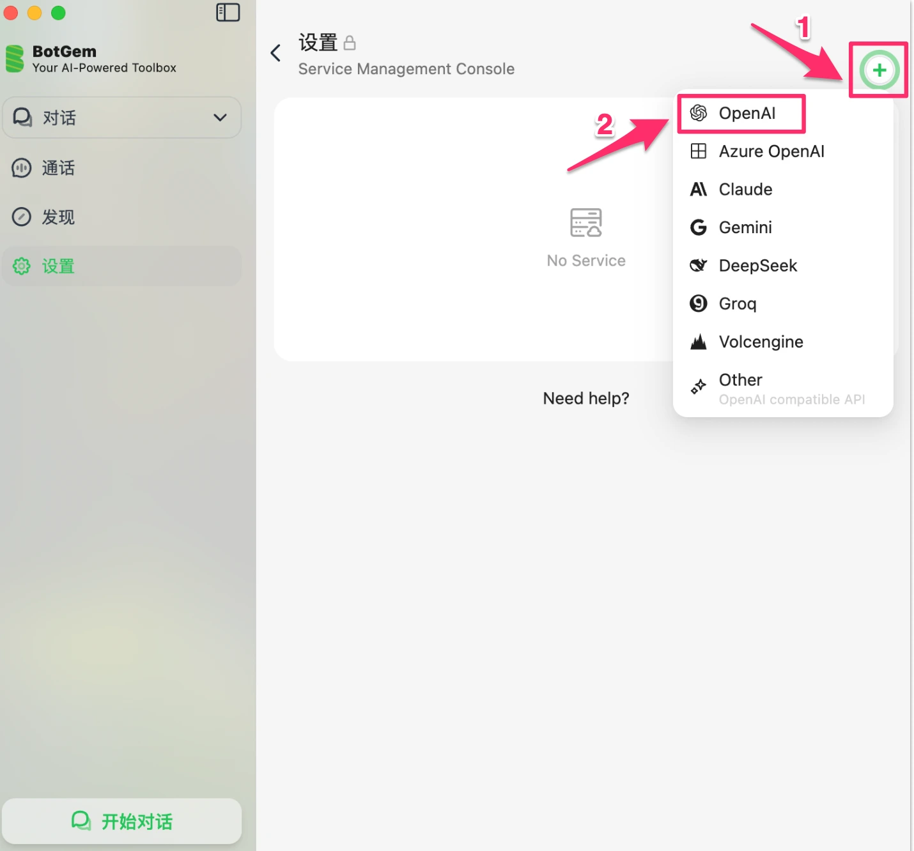
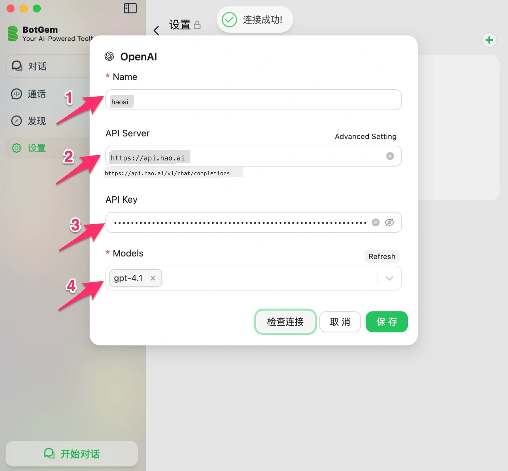
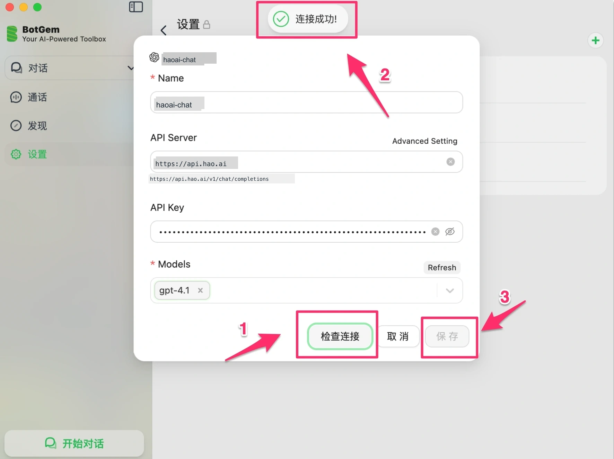
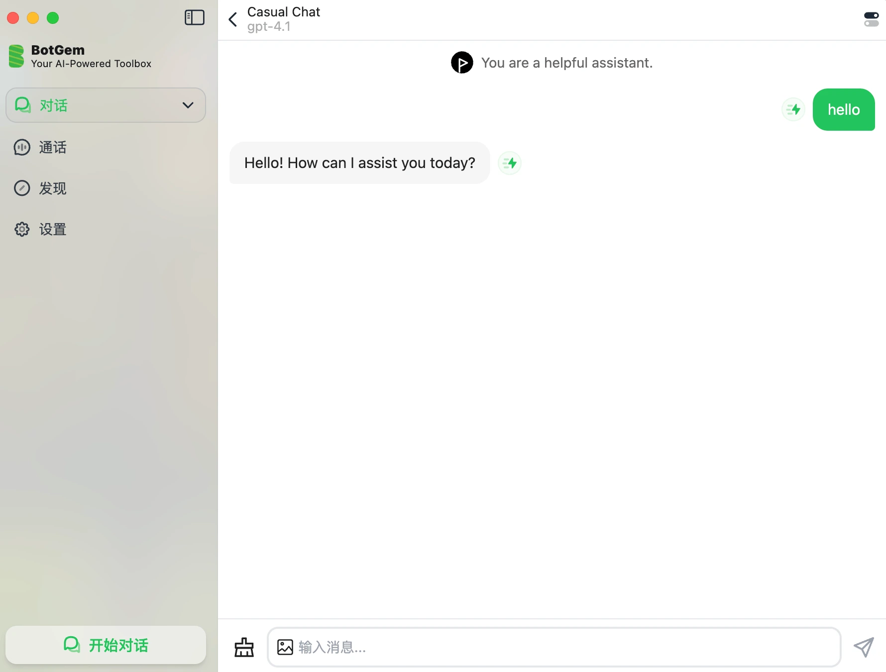

# BotGem Setup

[BotGem](https://botgem.com) is a cross-platform AI desktop client (macOS, Windows, iOS, Android) that supports custom API providers, making it easy to use for everyday AI conversations.

## Prerequisites

- An Look2Eye account with an API Key ([Get one here](https://api.look2eye.com/console/api-keys))
- BotGem installed ([Download](https://botgem.com))

## Setup Steps

### Step 1: Open Settings

Launch BotGem and click **Settings** in the left sidebar.

### Step 2: Go to Service Provider

In the Settings page, click **Service Provider**.

### Step 3: Click + and Select a Protocol

Click the **+** button in the top right and choose a protocol type.

Look2Eye supports three protocols — **OpenAI** is recommended:

| Protocol | Select | Supported Models |
| --- | --- | --- |
| **OpenAI Chat** (recommended) | OpenAI | `openai/gpt-4.1`, `openai/gpt-4.1-mini`, `openai/gpt-5.4-mini`, etc. (examples only) |
| **Claude** | Claude | `anthropic/claude-sonnet-4.6`, `anthropic/claude-opus-4.6`, `anthropic/claude-haiku-4.5` |
| **Gemini** | Gemini | `google/gemini-3.1-flash-lite-preview`, `google/gemini-3.1-pro-preview` |

> ⚠️ BotGem does not support the OpenAI Responses protocol (`/v1/responses`). This protocol uses an `input` field instead of `messages`, and BotGem only supports the standard Chat Completions format.

### Step 4: Fill in the Configuration

Fill in the configuration form based on the protocol selected in Step 3.

API Server by protocol:

| Protocol | API Server |
| --- | --- |
| **OpenAI Chat** (recommended) | `https://api.api.look2eye.com` |
| **Claude** | `https://api.api.look2eye.com/anthropic` |
| **Gemini** | `https://api.api.look2eye.com/gemini` |

Example using OpenAI Chat:

| Field | Value |
| --- | --- |
| **Name** | `look2eye` (or any name) |
| **API Server** | `https://api.api.look2eye.com` |
| **API Key** | Your Look2Eye API Key |
| **Models** | Click Refresh to auto-fetch, or type manually, e.g. `gpt-4.1` |

> ℹ️ When you enter `https://api.api.look2eye.com`, BotGem automatically appends `/v1/chat/completions`. Using OpenAI Chat, you can call any model — just use the `provider/model-name` format when typing manually, e.g. `anthropic/claude-opus-4.5` or `deepseek/deepseek-v3.2`.

### Step 5: Check Connection and Save

Click **Check Connection**. Once you see “**Connected successfully!**” at the top, click **Save**.

## Start Using

After saving, go back to the main screen and click **Start Chat**. The current model name is shown at the top of the chat window. Type your message to start.

## Troubleshooting

**Q: Connection check fails**

1. Make sure the API Server address is correct (see table above)
2. Make sure your API Key is copied in full from the [Look2Eye Console](https://api.look2eye.com/console/api-keys) with no extra spaces
3. Check your network connection

**Q: The model I want isn’t in the list**

Click **Refresh** to auto-fetch the model list. Names in the list have **no prefix** (e.g. `gpt-4.1`).

To use a model not in the list, **type the full model name** in the format `provider/model-name`, for example:

| Model | Input name |
| --- | --- |
| DeepSeek V3 | `deepseek/deepseek-v3.2` |
| Claude Sonnet | `anthropic/claude-sonnet-4.6` |
| Gemini Flash | `google/gemini-3.1-flash-lite-preview` |

See all available models at [Models](https://api.look2eye.com/models).
