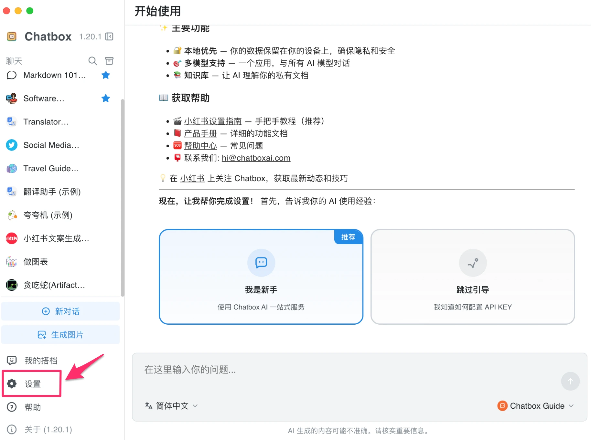
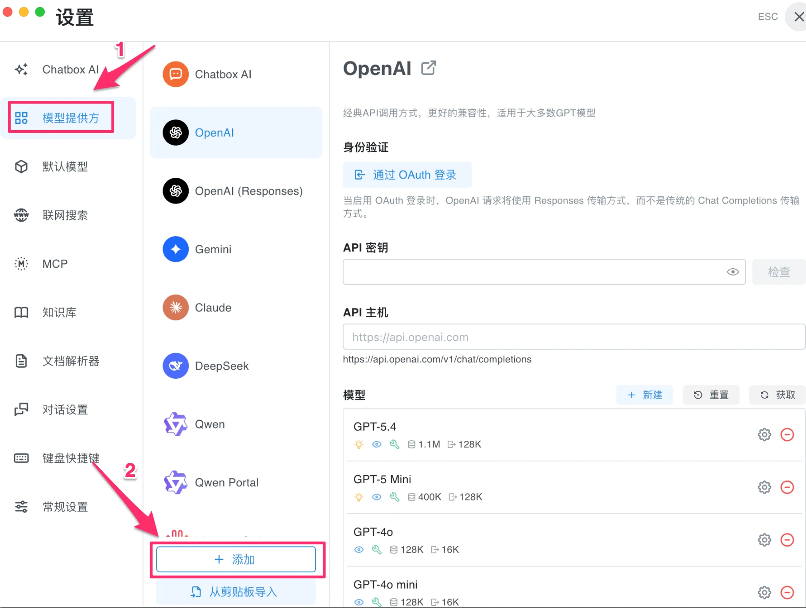
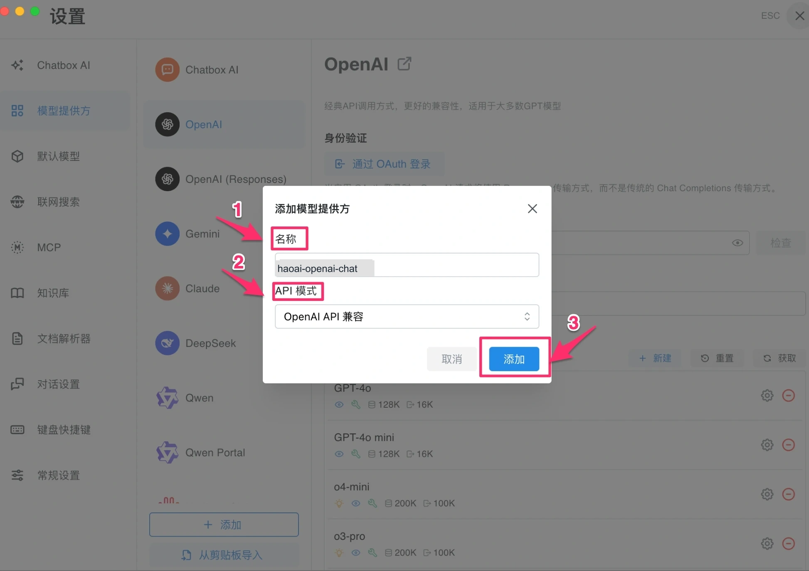
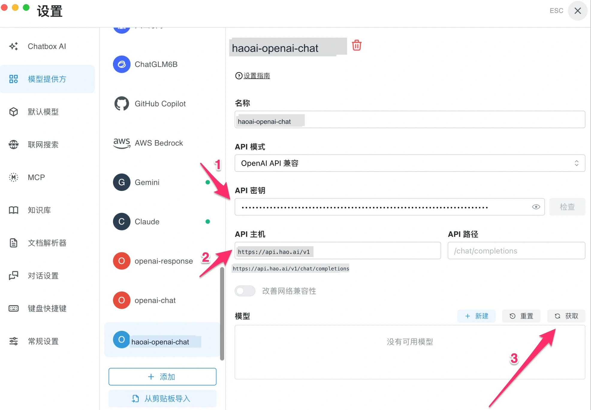
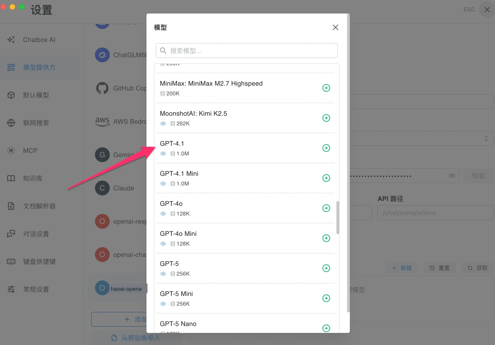
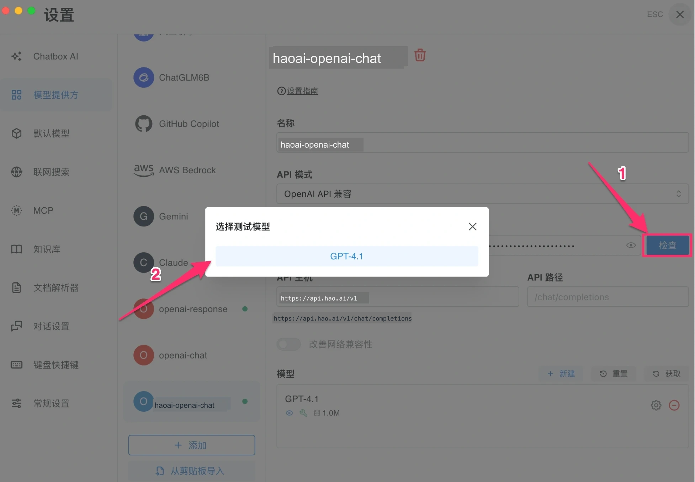
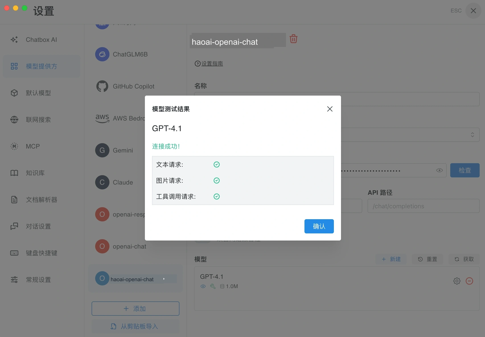
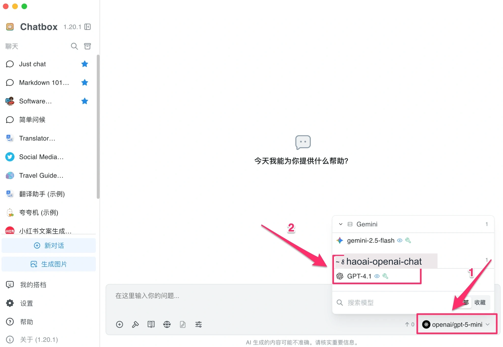

# Chatbox Configuration

[Chatbox](https://chatboxai.app) is a cross-platform AI desktop client (supports Windows, macOS, Linux, iOS, Android) with a clean interface and support for multiple AI service providers.

## Prerequisites

- A registered Look2Eye account with an API Key ([Get one here](https://api.look2eye.com/keys))
- Chatbox installed ([Download](https://chatboxai.app/en))

## Configuration Steps

### Step 1: Open Settings

Launch Chatbox and click **Settings** in the bottom-left corner.

### Step 2: Go to Model Providers and click + Add

Click **Model Providers** on the left, then click the **+ Add** button at the bottom.

### Step 3: Select API Mode

In the dialog that appears, enter a name and select the corresponding **API Mode**. Look2Eye supports the following four:

| API Mode | API Host | Example Models |
| --- | --- | --- |
| OpenAI API Compatible | `https://api.api.look2eye.com/v1` | `openai/gpt-4.1`, `openai/gpt-5.3-chat` |
| OpenAI Responses API Compatible | `https://api.api.look2eye.com/v1` | `openai/gpt-4.1`, `openai/gpt-5.3-chat` |
| Anthropic Claude API Compatible | `https://api.api.look2eye.com/anthropic/v1` | `anthropic/claude-sonnet-4.6`, `anthropic/claude-opus-4.6` |
| Google Gemini API Compatible | `https://api.api.look2eye.com/gemini` | `gemini-2.5-flash`, `gemini-3.1-pro-preview` |

Click **Add** when done.

### Step 4: Fill in Configuration Details

On the configuration page, enter your API Key and API Host, then click **Fetch** to automatically retrieve the model list.

| Field | Value |
| --- | --- |
| **API Key** | Your Look2Eye API Key |
| **API Host** | The address corresponding to the protocol selected in Step 3 |

### Step 5: Select Models

From the fetched model list, click **+** to add the models you need to the enabled list.

### Step 6: Test the Connection

Click the **Check** button, then select a model in the dialog to test.

When “**Connection successful!**” appears with green checkmarks for text requests, image requests, and tool call requests, the configuration is complete.

## Mobile Configuration (iOS/Android)

Chatbox supports iOS and Android. The mobile setup process is essentially the same as on desktop. Here is a mobile configuration example.

### Step 1: Open Settings and Fill in Details

Launch Chatbox, go to Settings, tap **+ Add Model Provider**, and fill in the configuration:

- **Name**: A custom name (e.g. “look2eye”)
- **API Mode**: Select the one you need (e.g. Claude API Compatible)
- **API Key**: Paste your Look2Eye API Key
- **API Host**: Enter the corresponding API address (e.g. for Claude: `https://api.api.look2eye.com/anthropic/v1`)

### Step 2: Configure Model Parameters

After tapping **Save**, go to the model configuration page and fill in:

- **Model ID**: e.g. `anthropic/claude-opus-4.7`
- **Model Type**: Select **Chat**
- **Capabilities**: Check as needed (vision, reasoning, tool use, etc.)

### Step 3: Test the Connection

Tap **Save**, then tap **Test Model** to run a connection test. A successful test shows “Connection successful!” with green checkmarks for each capability.

## Getting Started

Close the settings and return to the main interface. Click **Select Model** in the bottom-right corner, choose a model under the corresponding provider group, and start chatting.

## FAQ

**Q: The model list is empty after clicking “Fetch”**

Check that the API Host is entered correctly (no trailing slash) and that the API Key was copied in full.

**Q: Connection failed during the check**

1. Confirm the API Key was copied in full from the [Look2Eye Console](https://api.look2eye.com/keys) with no extra spaces
2. Confirm the API Host is entered correctly
3. Confirm your network connection is working
