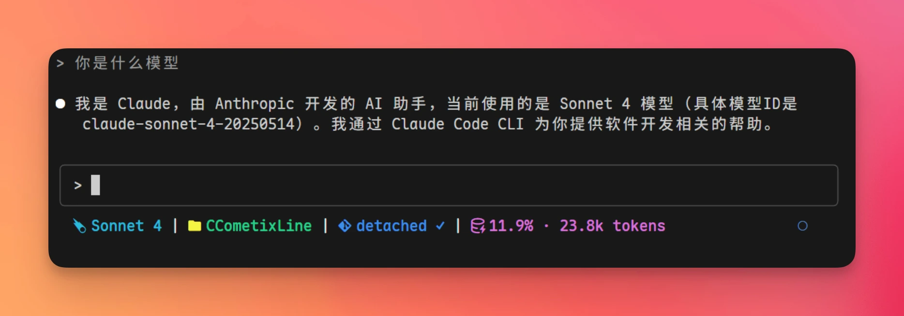

# CCometixLine Status Bar Plugin


[CCometixLine](https://github.com/Haleclipse/CCometixLine) is a Claude Code status bar enhancement tool that displays Git branch status, current model, and context window usage in real time, giving you instant visibility into key information while coding.





**Key Features:**


- **Git Status** — Branch name, clean / dirty / conflict state, remote tracking info
- **Model Display** — Simplified model name (e.g., `Sonnet 4` instead of the full identifier)
- **Context Usage** — Real-time token consumption percentage
- **Theme System** — Multiple built-in themes (cometix, minimal, gruvbox, nord, powerline-dark) with custom theme support


## Installation


> ℹ️ A [Nerd Font](https://www.nerdfonts.com/) must be installed in your terminal for icons to display correctly.


### Install via Claude Code (Recommended)


Send the following message in the Claude Code chat, and Claude will automatically complete the installation and configuration:


```text filename="Send to Claude Code"
Install this for me: https://github.com/Haleclipse/CCometixLine
and configure it in Claude Code global settings to enable it
```


Claude Code will automatically:


1. Clone the repository and build/install CCometixLine
2. Write the status bar configuration to `~/.claude/settings.json`
3. Take effect after restart


### Manual Installation


Install globally via npm and configure manually:


```text
npm install -g ccline
```


Add the following configuration to `~/.claude/settings.json`:


```json filename="~/.claude/settings.json"
{
  "env": {
    "CLAUDE_CODE_STATUSLINE": "ccline"
  }
}
```


Restart Claude Code for changes to take effect.


## Customization


CCometixLine provides an interactive TUI configuration panel. Run the following command to open it:


```text
ccline config
```


In the configuration panel, you can preview and adjust in real time:


- Status bar layout and display items
- Theme switching and custom color schemes
- Git information display granularity


For more details, see the [GitHub repository](https://github.com/Haleclipse/CCometixLine).
