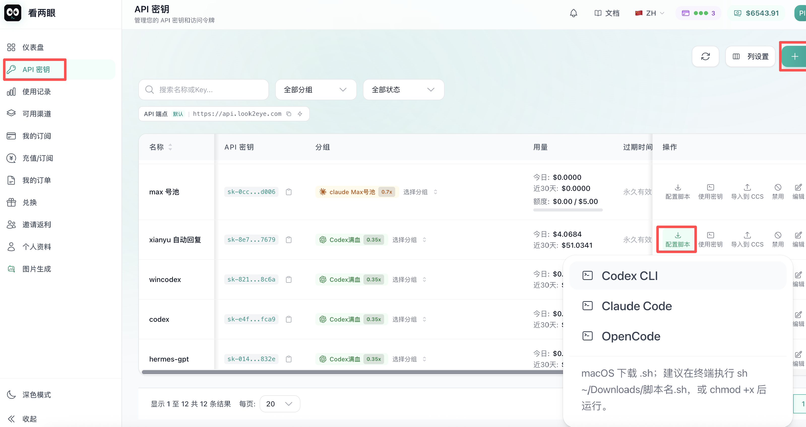
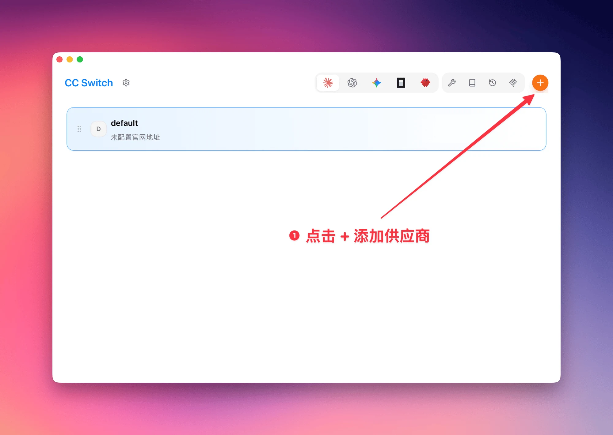
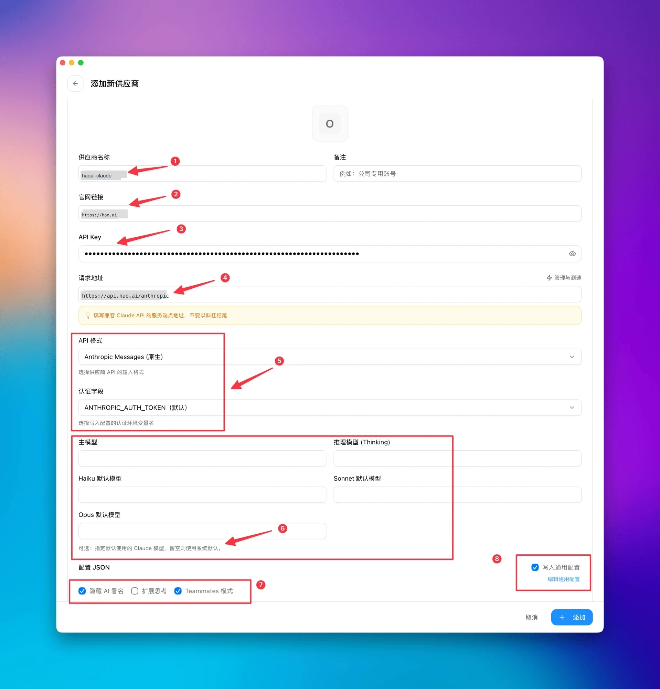
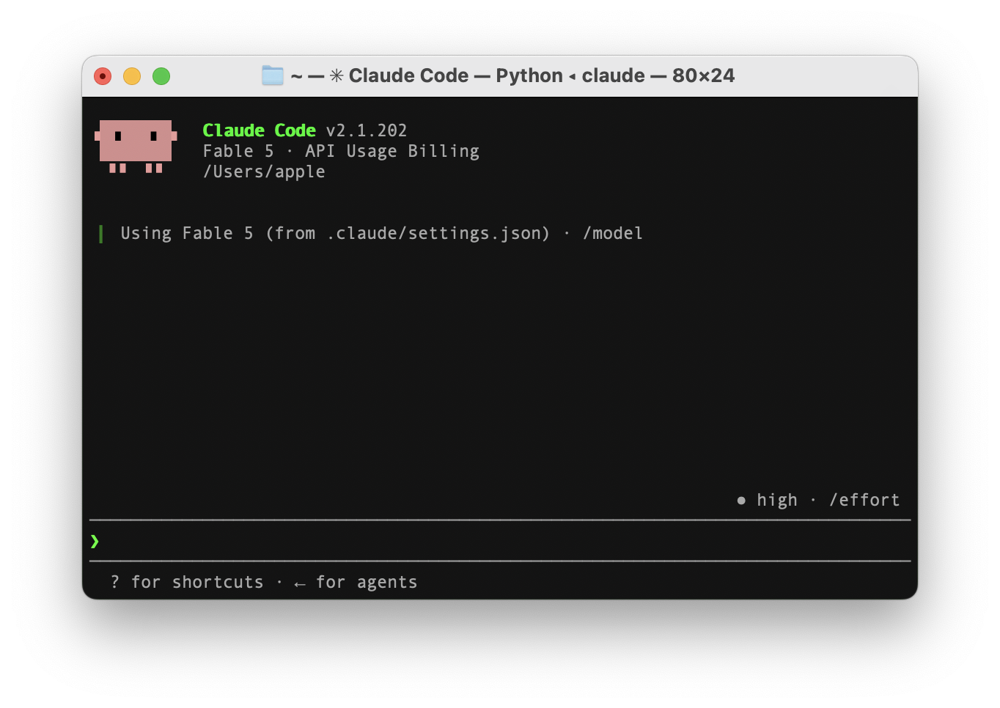
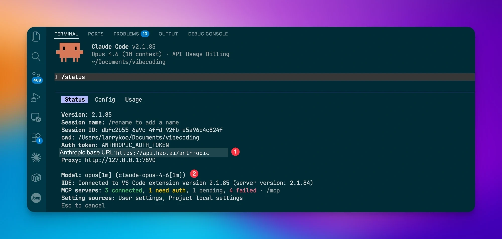

# Configure Model Provider


We recommend using the [platform](https://api.look2eye.com/keys)'s one-click configuration script to complete the setup, or use [CC Switch](https://github.com/farion1231/cc-switch) — an open-source provider management tool with a visual interface, no need to manually edit JSON or environment variables.


## Method 1: Use the Platform One-Click Script (Recommended)



Select **Claude Code**, download the script, and run it.

Windows

```
Run the downloaded .bat script directly
```

macOS

```
Drag the .sh script into Terminal to run it. If permission is denied, run: chmod +x script.sh
```

## Method 2: Install CC Switch


### macOS


```text
brew install --cask cc-switch
```


Or go to [Releases](https://github.com/farion1231/cc-switch/releases) to download the `.dmg` for manual installation.


### Windows


Go to [Releases](https://github.com/farion1231/cc-switch/releases) to download the `.msi` installer.


### Linux


```text
# Debian / Ubuntu
sudo dpkg -i CC-Switch-*.deb

# Fedora / RHEL
sudo rpm -i CC-Switch-*.rpm

# AppImage
chmod +x CC-Switch-*.AppImage && ./CC-Switch-*.AppImage
```


> ℹ️ Supports macOS 12+, Windows 10+, Ubuntu 22.04+ / Debian 11+ / Fedora 34+


## 2. Add Look2Eye Provider


### Step 1: Add a New Provider


Open CC Switch, go to the provider management page, and click the **+** button in the upper right corner.





### Step 2: Fill in the Configuration


Fill in the fields as shown in the image below, then click **+ Add** to complete.





| Field | Value | Description |
| --- | --- | --- |
| ❶ Provider Name | `look2eye-claude` | Custom name for easy identification |
| ❷ Website URL | `https://api.look2eye.com` | Provider website |
| ❸ API Key | Your Look2Eye API Key | Get it at [api.look2eye.com/keys](https://api.look2eye.com/keys) |
| ❹ Request URL | `https://api.look2eye.com/anthropic` | Do not add a trailing slash |
| ❺ API Format / Auth Field | `Anthropic Messages (Native)` / `ANTHROPIC_AUTH_TOKEN (Default)` | Keep defaults |
| ❻ Model Configuration | Leave empty | Leave empty to use the default Claude model |
| ❼ Options | Check “Hide AI Signature” and “Teammates Mode” | Check as needed |
| ❽ Write to Global Config | ✅ Checked | Writes to global config, applies to all projects |


> ℹ️ CC Switch automatically writes to `~/.claude/settings.json` — no manual file editing required.


### Step 3: Activate the Provider


After adding, return to the list, select `look2eye-claude`, and click the **Use** button. A “Switched successfully” notification confirms the setup is complete.


## 3. Verify Configuration


Navigate to your project directory and start Claude Code:


```text
cd your-project
claude
```


On first launch, press `Esc` to skip login. After startup, check the top info bar and confirm it shows **API Usage Billing** (❶), indicating billing through Look2Eye:





If the above information is correct, the configuration is successful.


## 4. Use Other Models


With Look2Eye, you can use non-Claude models (such as Qwen, GLM, DeepSeek, etc.) in Claude Code. Simply filter compatible models from the Model Plaza and configure model mapping.


### Step 1: Filter Compatible Models


Go to the [Look2Eye Model Plaza](https://api.look2eye.com/models), and select **Anthropic** under **API Protocol** on the left sidebar to filter models that support the Anthropic protocol.


### Step 2: Copy the Model Name


Click on the target model card — there’s a **copy button** next to the model name to copy the model ID with one click (e.g., `bailian/qwen3.6-plus`).


### Step 3: Configure Model Mapping


Go back to CC Switch and find the **Model Mapping** section in the provider configuration. Fill in the copied model name into the corresponding model slots. Browse compatible models at the [Look2Eye Model Plaza](https://api.look2eye.com/models):


| Mapping Slot | Description |
| --- | --- |
| **Primary Model** | Default model used by Claude Code |
| **Thinking Model** | Model for deep reasoning |
| **Haiku Default** | Lightweight task model |
| **Sonnet Default** | Medium complexity task model |
| **Opus Default** | High complexity task model |

> ℹ️ Claude thinking parameters depend on the model version: Sonnet 4.5 uses `enabled + budget_tokens`; Sonnet 4.6 / Opus 4.6 should use `adaptive`. See [Claude Thinking Modes in the Anthropic Messages API](https://api.look2eye.com/en/api/anthropic/messages#claude-thinking-modes) for the full matrix.


> ℹ️ If the provider natively offers Claude series models, model mapping is usually not needed. Only fill this in when you need to map requests to different model names.


## Troubleshooting


If you encounter issues, run `/status` in the Claude Code terminal to check the configuration:


```text
/status
```


Verify the following key fields:


- **❶ Anthropic base URL** is `https://api.look2eye.com/anthropic`
- **❷ Model** shows the currently active model





**Q: “Authentication error” message**


Confirm the `Anthropic base URL` is correct and check that the API Key is valid.


**Q: Connection timeout**


Verify the request URL is `https://api.look2eye.com/anthropic` with no trailing slash.


**Q: Streaming response lag**


Look2Eye has built-in global acceleration. This is usually a local network issue — check your local connection and retry.
