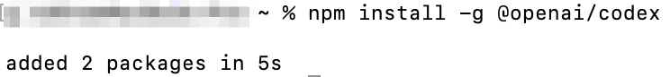
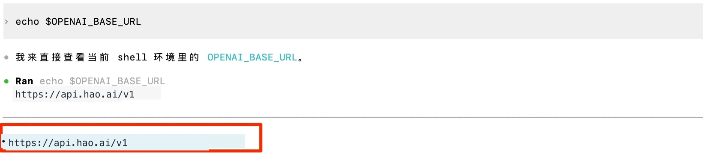

# Install Codex CLI


Codex CLI is OpenAI’s AI coding command-line tool for AI-assisted coding directly in your terminal.


> ℹ️ If you already have a Codex local client installed and the `codex` command works in your terminal, you can skip installation and continue to provider configuration.


## Prerequisites


- [Look2Eye API Key](https://api.look2eye.com/keys) (sign up to get one)
- [Node.js](https://nodejs.org) (v18+ recommended)


## Install


```text
npm install -g @openai/codex
```





## Verify Installation


```text
codex --version
# A version number output indicates successful installation
```





> ℹ️ If you see `command not found`, make sure Node.js is installed (`node --version`), then re-run the install command.


## Next Steps


- [Configure Model Provider](model-provider.md) — Manage the Look2Eye API key and request URL through CC Switch
