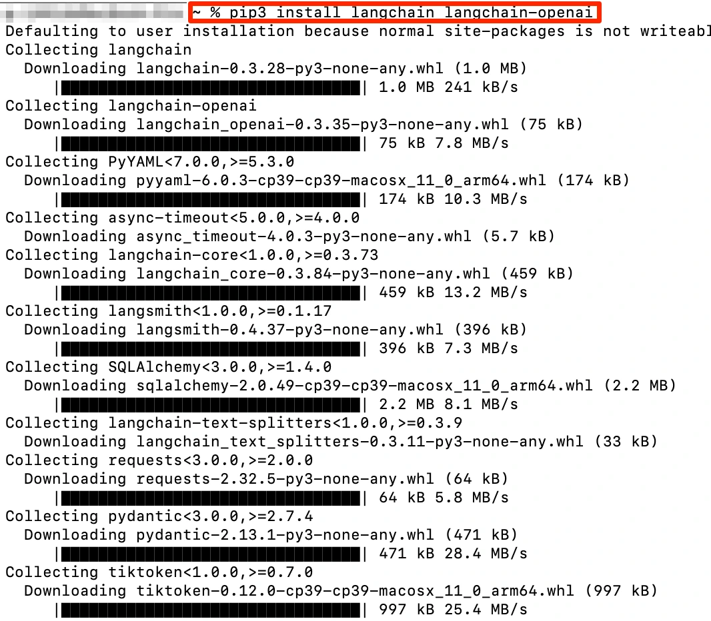
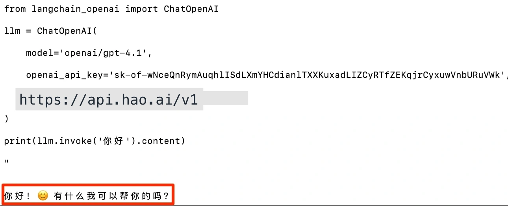

# LangChain Configuration


[LangChain](https://python.langchain.com) is a development framework for building AI applications, supporting Python and JavaScript. Since Look2Eye is fully compatible with the OpenAI protocol, you only need to change the `openai_api_base` to get started.


## Prerequisites


- An Look2Eye account with an API Key ([Get one here](https://api.look2eye.com/keys))
- Python 3.8+ installed


## Configuration Steps


### Step 1: Install Dependencies


```text
pip3 install langchain langchain-openai
```





### Step 2: Configure and Run


**Python**

```python filename="example.py"
from langchain_openai import ChatOpenAI

llm = ChatOpenAI(
    model="openai/gpt-4.1",
    openai_api_key="<YOUR_LOOK2EYE_API_KEY>",
    openai_api_base="https://api.look2eye.com/v1"
)

response = llm.invoke("Hello")
print(response.content)
```


Run:


```text
python3 -W ignore example.py
```

**JavaScript**

```js filename="example.js"

const llm = new ChatOpenAI({
  model: "openai/gpt-4.1",
  openAIApiKey: "<YOUR_LOOK2EYE_API_KEY>",
  configuration: {
    baseURL: "https://api.look2eye.com/v1"
  }
})

const response = await llm.invoke("Hello")
console.log(response.content)
```





## Available Models


For recommended models, see the [Look2Eye Model Marketplace](https://api.look2eye.com/models).


## FAQ


**Q: `ModuleNotFoundError: No module named 'langchain_openai'`**


Run `pip3 install langchain-openai` to install the missing package.


**Q: API Key is invalid**


Make sure the `openai_api_key` is your Look2Eye API Key, not an official OpenAI Key.
