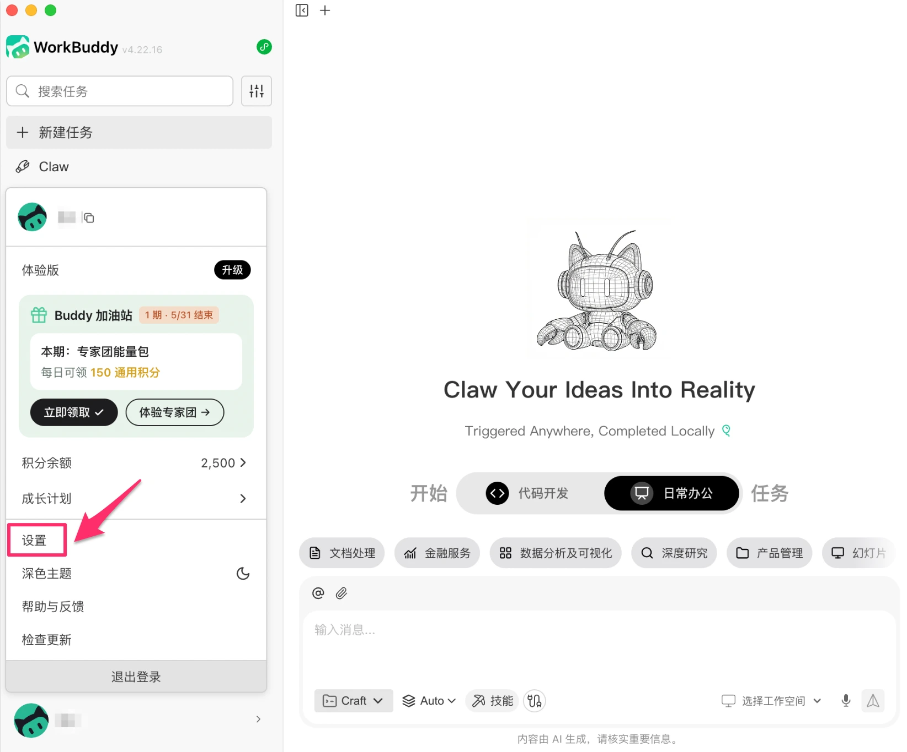
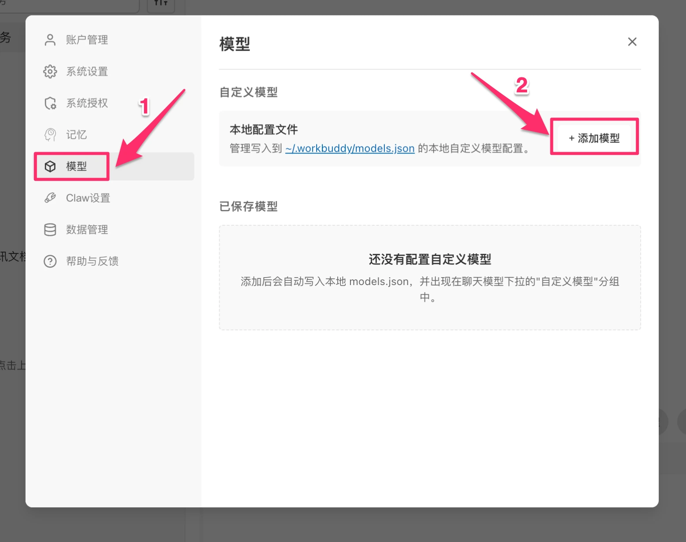
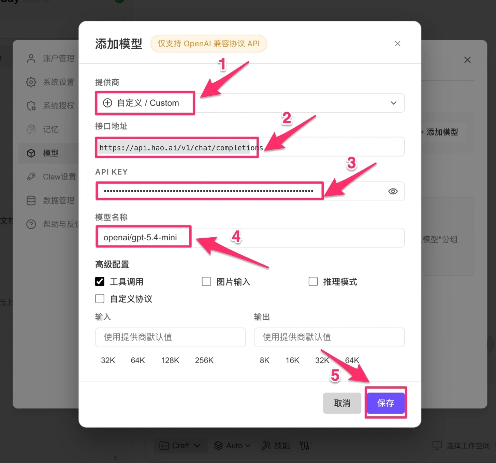
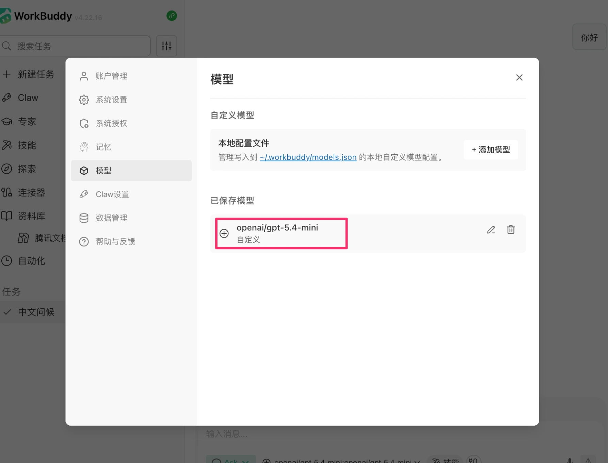
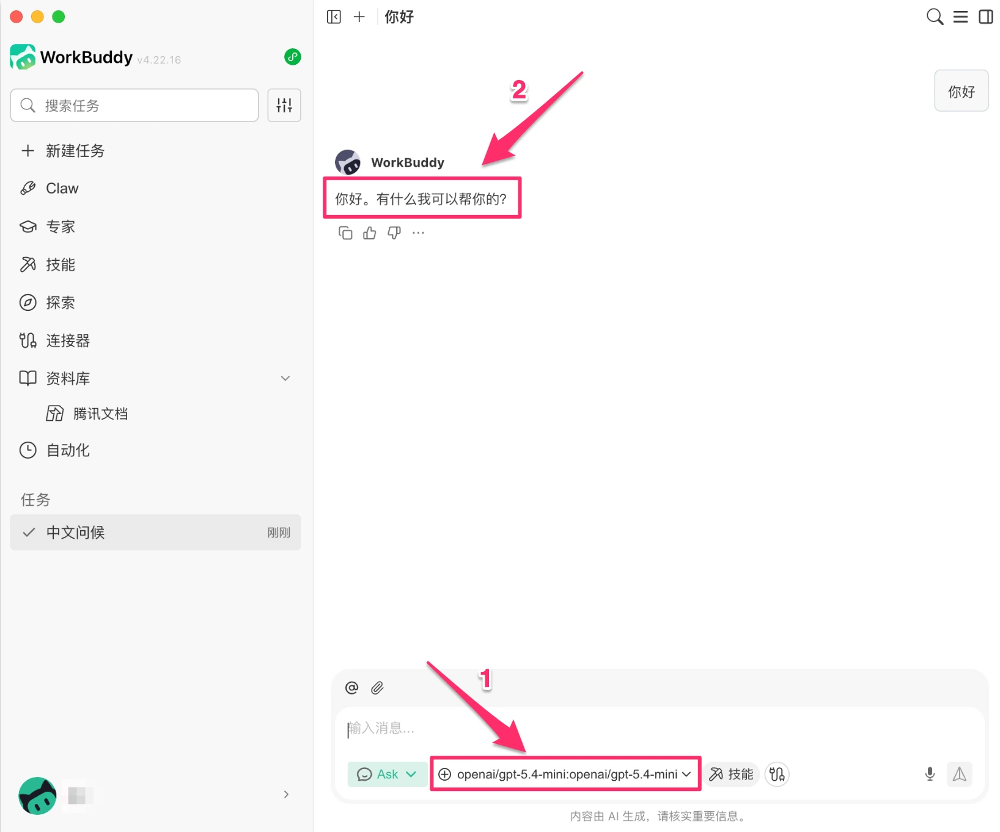

# WorkBuddy Configuration

[WorkBuddy](https://workbuddy.ai) is an AI Agent desktop app from Tencent that supports everyday office tasks, coding, document processing, and more. By connecting Look2Eye, you can use GPT, Claude, Gemini, DeepSeek, and other leading global models with a single API Key.

## Prerequisites

- A registered Look2Eye account with an API Key ([Get one here](https://api.look2eye.com/keys))
- WorkBuddy installed ([Download](https://workbuddy.ai))

## Configuration Steps

### Step 1: Open Settings

Launch WorkBuddy, click your avatar in the bottom-left corner, then click **Settings** in the pop-up menu.

### Step 2: Go to Model Configuration

Click **Models** in the left navigation of the settings page, then click **+ Add Model** on the right.

### Step 3: Fill in Configuration

In the “Add Model” dialog, fill in the following:

| Field | Value |
| --- | --- |
| **Provider** | `Custom` |
| **API Endpoint** | `https://api.look2eye.com/v1/chat/completions` |
| **API KEY** | Your Look2Eye API Key |
| **Model Name** | The model ID you want, e.g. `openai/gpt-5.4-mini` |

> ℹ️ WorkBuddy only supports the OpenAI-compatible protocol. Through Look2Eye’s `/v1/chat/completions` endpoint, you can access GPT, Claude, Gemini, DeepSeek, and all other models — just enter the model ID in the **Model Name** field. See the [Model Gallery](https://api.look2eye.com/models) for available models.

Check the advanced options as needed:

| Option | Description |
| --- | --- |
| **Tool Call** | Check for models that support function calling (checked by default) |
| **Image Input** | Check when using vision models |
| **Reasoning Mode** | Check when using reasoning models |

Click **Save** when done.

### Step 4: Confirm Model is Saved

The model will appear in the “Saved Models” list after saving.

### Step 5: Start Chatting

Return to the main interface, click the model selector at the bottom, choose your newly configured model under the “Custom Models” group, and start chatting.

## Recommended Models

See the [Model Gallery](https://api.look2eye.com/models) for recommended models.

## FAQ

**Q: Can I use Claude or Gemini models?**

Yes. Through Look2Eye’s OpenAI-compatible endpoint, all models are accessible. Just enter the model ID in the **Model Name** field — see the [Model Gallery](https://api.look2eye.com/models) for available models.

**Q: The model doesn’t appear in the selection list after saving**

Try restarting WorkBuddy. Newly added models will appear under the “Custom Models” group in the model selector at the bottom of the chat interface.

**Q: Request fails or API error**

Check that the API endpoint is complete (`https://api.look2eye.com/v1/chat/completions`) and that the API KEY was copied in full from the [Look2Eye Console](https://api.look2eye.com/keys) with no extra spaces.
