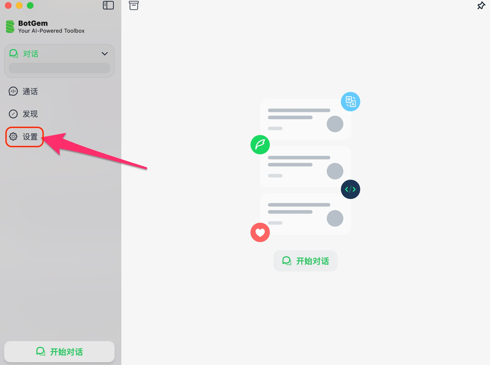
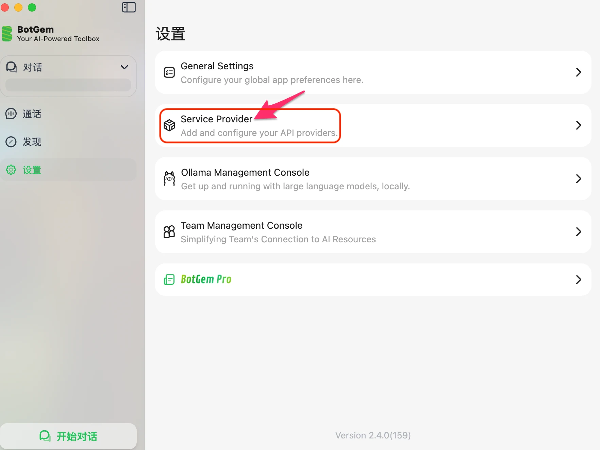
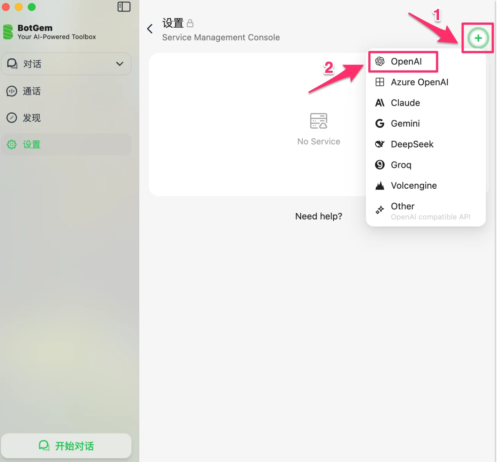
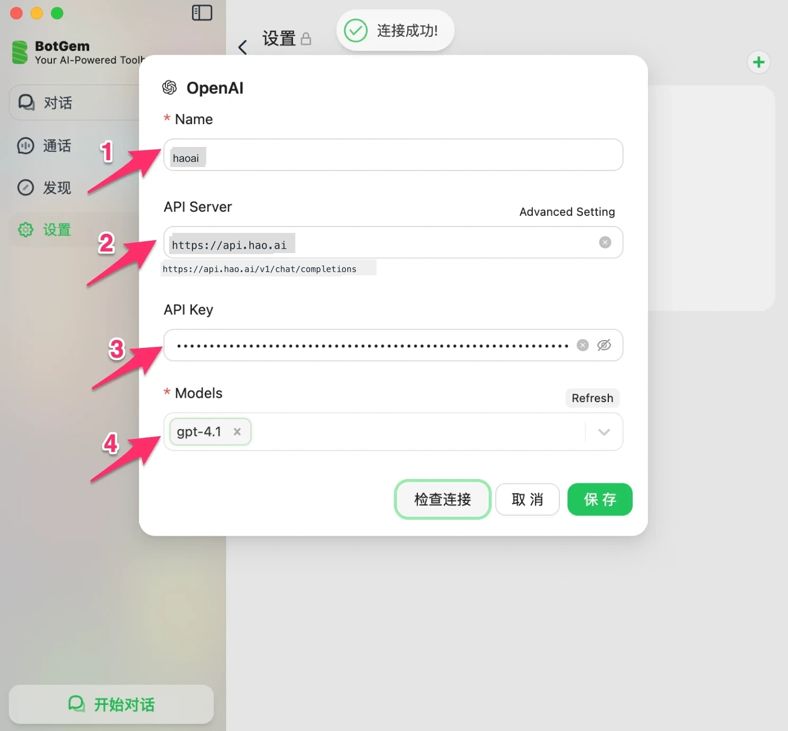
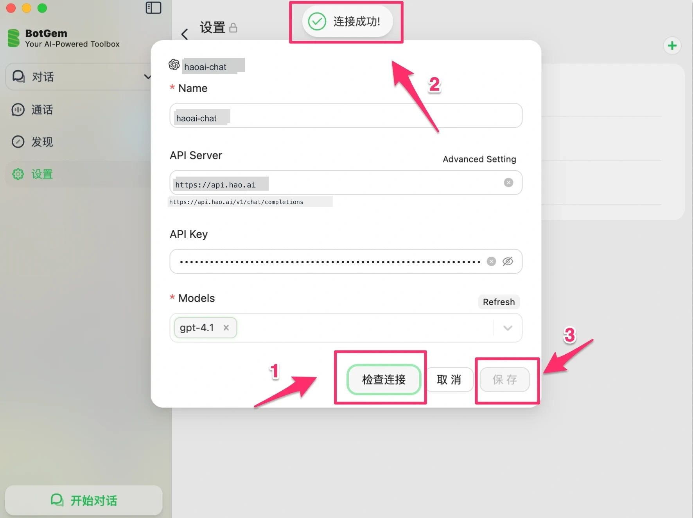
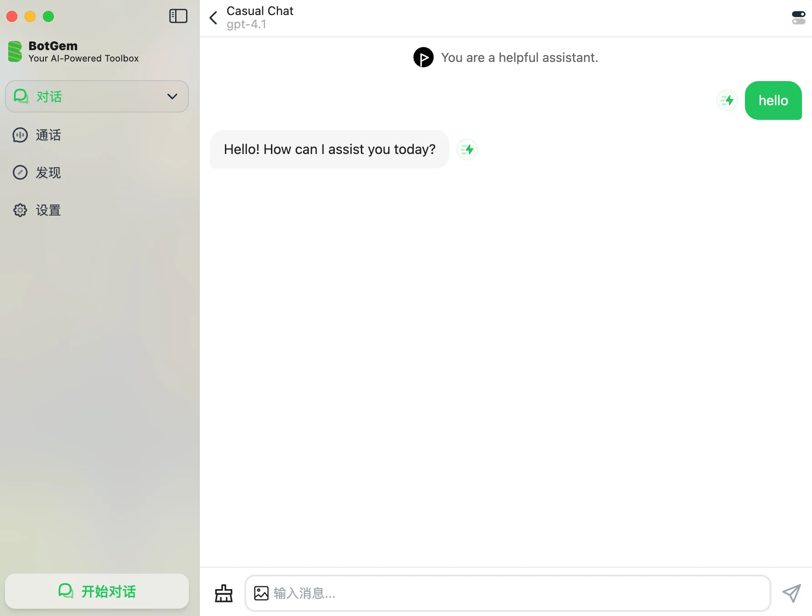

# BotGem 配置

[BotGem](https://botgem.com)  是一款跨平台 AI 桌面客户端（支持 macOS、Windows、iOS、Android），支持自定义 API 服务商，适合日常 AI 对话使用。

## 前提条件

-   已注册 Look2Eye 账号并获取 API Key（[前往获取](https://api.look2eye.com/keys) ）
-   已安装 BotGem（[下载地址](https://botgem.com) ）

## 配置步骤

### 第 1 步：打开设置

启动 BotGem，点击左侧边栏的 **设置**。

### 第 2 步：进入 Service Provider

在设置页面中，点击 **Service Provider**。

### 第 3 步：点击 + 选择协议

点击右上角的 **+** 按钮，根据需要选择协议类型。

Look2Eye 支持以下三种协议，推荐选择 **OpenAI**：

| 协议 | 选择 | 适用模型 |
| --- | --- | --- |
| **OpenAI Chat**（推荐） | OpenAI | `openai/gpt-4.1`、`openai/gpt-4.1-mini`、`openai/gpt-5.4-mini` 等（部分示例） |
| **Claude** | Claude | `anthropic/claude-sonnet-4.6`、`anthropic/claude-opus-4.6`、`anthropic/claude-haiku-4.5` |
| **Gemini** | Gemini | `google/gemini-3.1-flash-lite-preview`、`google/gemini-3.1-pro-preview` |

> ⚠️ BotGem 暂不支持 OpenAI Responses 协议（`/v1/responses`）。该协议使用 `input` 字段而非 `messages`，BotGem 目前仅支持标准 Chat Completions 格式。

### 第 4 步：填写配置信息

在弹出的配置表单中填写以下信息。

根据第 3 步选择的协议，填写对应的 API Server：

| 协议 | API Server |
| --- | --- |
| **OpenAI Chat**（推荐） | `https://api.api.look2eye.com` |
| **Claude** | `https://api.api.look2eye.com/anthropic` |
| **Gemini** | `https://api.api.look2eye.com/gemini` |

以 OpenAI Chat 为例：

| 配置项 | 值 |
| --- | --- |
| **Name** | `look2eye`（或任意名称） |
| **API Server** | `https://api.api.look2eye.com` |
| **API Key** | 你的 Look2Eye API Key |
| **Models** | 点击 Refresh 自动拉取，或手动输入，例如 `gpt-4.1` |

> ℹ️ API Server 填 `https://api.api.look2eye.com` 后，BotGem 会自动补全为 `https://api.api.look2eye.com/v1/chat/completions`。通过 OpenAI Chat 协议可调用所有厂商模型，手动输入时使用 `厂商/模型名` 格式，例如 `anthropic/claude-opus-4.5`、`deepseek/deepseek-v3.2`。

### 第 5 步：检查连接并保存

点击 **检查连接** 按钮，看到顶部出现「**连接成功！**」提示后，点击 **保存**。

## 开始使用

保存后回到主界面，点击左下角 **开始对话**，顶部会显示当前使用的模型名称，直接在输入框输入消息即可开始使用。

## 常见问题

**Q: 点击「检查连接」提示失败**

1.  确认 API Server 地址填写正确（见上方表格）
2.  确认 API Key 从 [Look2Eye 控制台](https://api.look2eye.com/keys)  完整复制，无多余空格
3.  确认网络连接正常

**Q: 模型列表里没有我想用的模型**

点击 Models 右侧的 **Refresh** 按钮可自动拉取模型列表，列表中的名称**不带前缀**（如 `gpt-4.1`）。

如果想使用列表之外的模型，需要**手动输入完整模型名**，格式为 `厂商/模型名`。完整模型列表可在 [Look2Eye 模型广场](https://api.look2eye.com/models)  查看。
