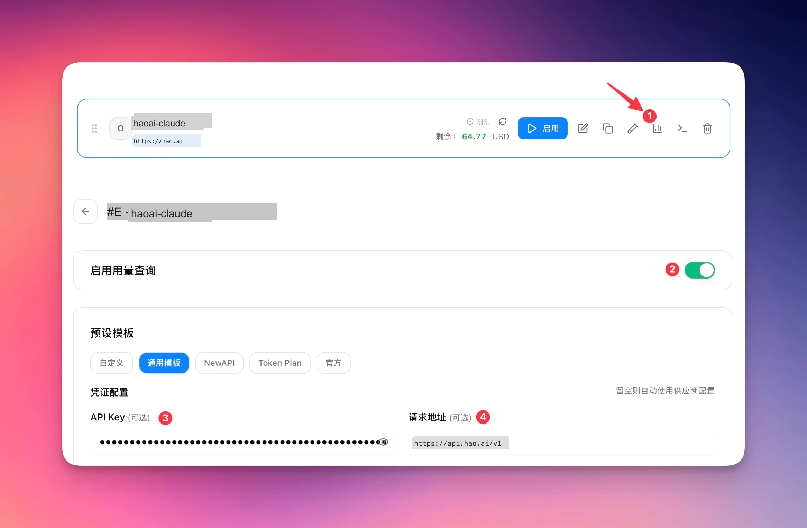

# CC-Switch 配置

CC-Switch 是一个功能强大的多模型管理工具，支持在单一界面中集成 Look2Eye 和其他 AI 模型提供商。现在 CC-Switch 新增了**用量查询功能**，可以实时监控 Look2Eye 账户的 API 使用情况。

## 前提条件

-   已注册 Look2Eye 账号并获取 API Key（[前往获取](https://api.look2eye.com/console/api-keys) ）
-   已安装并配置 [CC-Switch](https://github.com/cc-dayx/cc-switch)

## 配置步骤

### 第 1 步：添加 Look2Eye 提供商

在 CC-Switch 中添加新的提供商，配置以下信息：

| 配置项 | 值 |
| --- | --- |
| **提供商名称** | `look2eye-claude`（或自定义名称） |
| **API Base URL** | `https://api.api.look2eye.com/v1` |
| **API Key** | 你的 Look2Eye API Key |

### 第 2 步：启用用量查询

下图展示了如何在 CC-Switch 中配置用量查询：

**配置要点：**

1.  **启用用量查询** — 打开右侧的绿色开关（见截图标号 ②）
2.  **API Key 配置** — 填入你的 Look2Eye API Key（标号 ③）
3.  **请求地址** — 设置为 `https://api.api.look2eye.com/v1`（标号 ④）
4.  **预设模板** — 选择 **通用模板** 获得最佳兼容性

### 第 3 步：验证配置

配置完成后，你可以：

-   在 CC-Switch 的仪表板查看实时用量统计
-   监控 API 调用次数和 Token 消耗
-   追踪成本和预算消耗情况

> ℹ️ 用量查询功能通过定期调用 Look2Eye API 获取账户统计信息，请确保 API Key 具有足够权限。

> ⚠️ 请勿在公开的代码仓库中提交 API Key。建议使用环境变量或密钥管理系统安全存储 API Key。

## 支持的模型

CC-Switch 通过 Look2Eye 可以访问全球顶级模型。详见 [Look2Eye 模型广场](https://api.look2eye.com/models) 。

## 常见问题

**Q: 用量查询多久更新一次？**

用量数据通常在 API 调用后几分钟内更新，具体取决于 Look2Eye 系统的处理速度。

**Q: 如何关闭用量查询？**

在 CC-Switch 中关闭提供商的用量查询开关即可，这不会影响 API 的正常调用。

**Q: 用量查询会消耗 API 配额吗？**

不会。用量查询通过专门的统计 API 获取数据，不会占用您的 API 调用限额。

**Q: 支持多个 Look2Eye 账户吗？**

支持。在 CC-Switch 中可以添加多个 Look2Eye 提供商配置，使用不同的 API Key。
