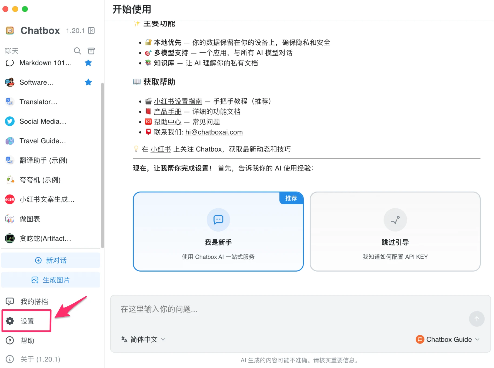
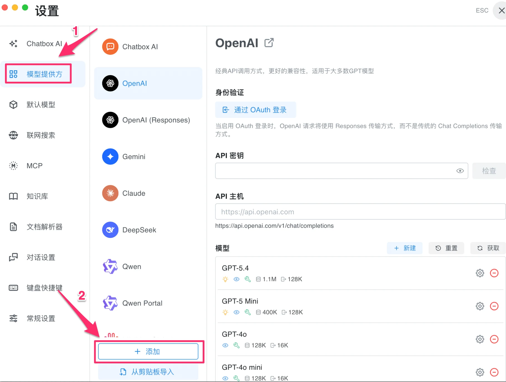
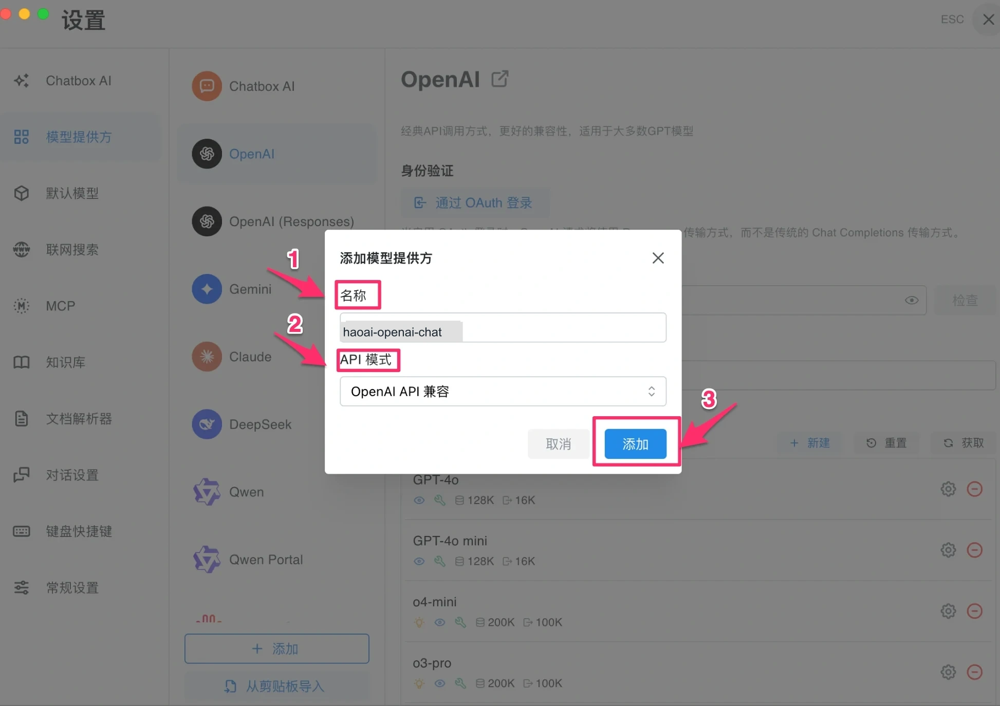
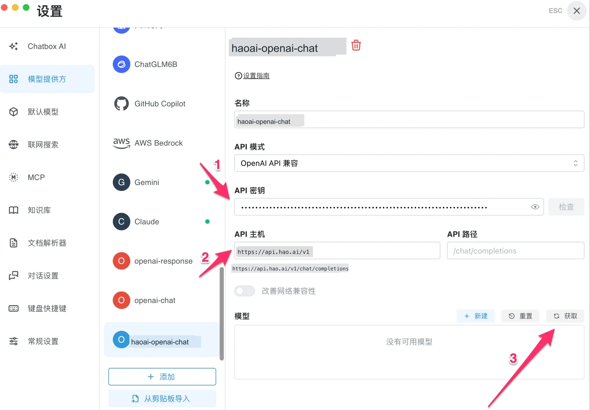
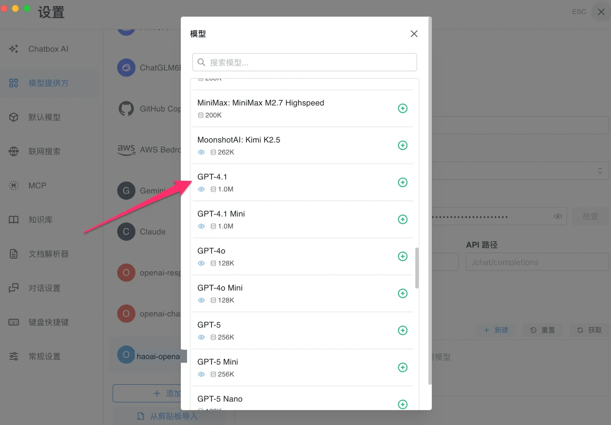
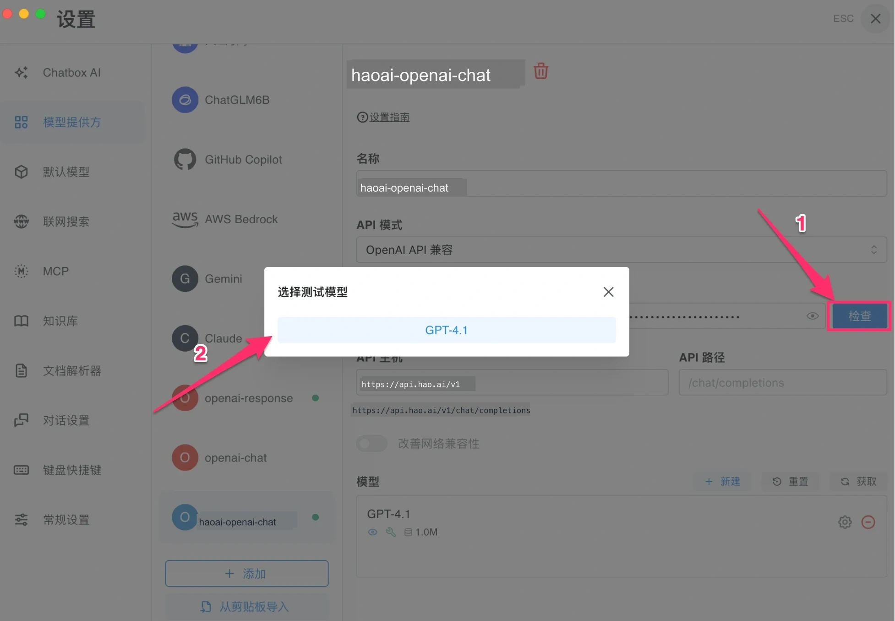
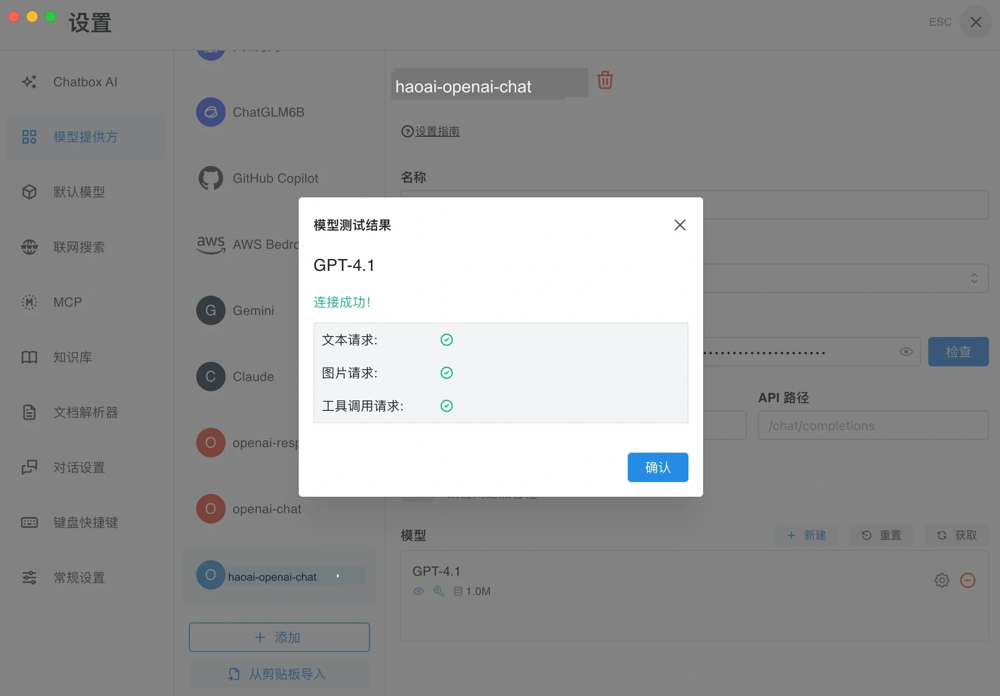
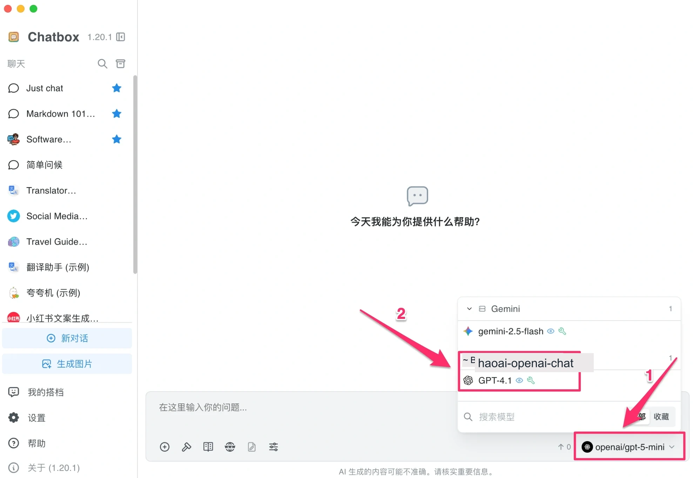

# Chatbox 配置

[Chatbox](https://chatboxai.app)  是一款跨平台 AI 桌面客户端（支持 Windows、macOS、Linux、iOS、Android），界面简洁，支持多种 AI 服务商配置。

## 前提条件

-   已注册 Look2Eye 账号并获取 API Key（[前往获取](https://api.look2eye.com/keys) ）
-   已安装 Chatbox（[下载地址](https://chatboxai.app/zh) ）

## 配置步骤

### 第 1 步：打开设置

启动 Chatbox，点击左下角的 **设置**。

### 第 2 步：进入模型提供方，点击 + 添加

点击左侧 **模型提供方**，在底部点击 **\+ 添加** 按钮。

### 第 3 步：选择 API 模式

在弹出的对话框中，填写名称并选择对应的 **API 模式**，Look2Eye 支持以下四种：

| API 模式 | API 主机 | 示例模型 |
| --- | --- | --- |
| OpenAI API 兼容 | `https://api.look2eye.com` | `openai/gpt-4.1`、`openai/gpt-5.3-chat` |
| OpenAI Responses API 兼容 | `https://api.look2eye.com` | `openai/gpt-4.1`、`openai/gpt-5.3-chat` |
| Anthropic Claude API 兼容 | `https://api.look2eye.com` | `anthropic/claude-sonnet-4.6`、`anthropic/claude-opus-4.6` |
| Google Gemini API 兼容 | `https://api.look2eye.com` | `gemini-2.5-flash`、`gemini-3.1-pro-preview` |

选择完成后点击 **添加**。

### 第 4 步：填写配置信息

在配置页中填写 API 密钥和 API 主机，然后点击 **获取** 自动拉取模型列表。

| 配置项 | 值 |
| --- | --- |
| **API 密钥** | 你的 Look2Eye API Key |
| **API 主机** | 根据第 3 步选择的协议填写对应地址 |

### 第 5 步：选择模型

从拉取的模型列表中，点击 **+** 将需要的模型添加到启用列表。

### 第 6 步：测试连接

点击 **检查** 按钮，在弹出的对话框中选择一个模型进行测试。

出现「**连接成功！**」，文本请求、图片请求、工具调用请求均显示绿色对勾，即表示配置成功。

## 手机端配置（iOS/Android）

Chatbox 支持 iOS 和 Android，手机端配置步骤与桌面端基本相同。以下为手机端配置示例。

### 第 1 步：打开设置并填写信息

启动 Chatbox，进入设置页面，点击 **\+ 添加模型提供方**，填写配置信息：

-   **名称**：自定义名称（如 “look2eye”）
-   **API 模式**：根据需要选择（如 Claude API 兼容）
-   **API 密钥**：粘贴你的 Look2Eye API Key
-   **API 主机**：填写对应的 API 地址（如 Claude 为 `https://api.look2eye.com/anthropic/v1`）

### 第 2 步：配置模型参数

点击 **保存** 后，进入模型配置页面。填写以下信息：

-   **模型 ID**：从 [Look2Eye 可用渠道](https://api.look2eye.com/available-channels)  复制模型 ID 填入
-   **模型类型**：选择 **聊天**
-   **能力**：根据需要勾选（视觉、推理、工具使用等）

### 第 3 步：测试连接

点击 **保存**，然后点击 **测试模型** 进行连接测试。测试成功会显示”连接成功！“及各项能力的绿色对勾。

## 开始使用

关闭设置，回到主界面，点击右下角 **选择模型**，在对应服务商分组下选择模型，即可开始对话。

## 常见问题

**Q: 点击「获取」后模型列表为空**

检查 API 主机是否填写正确（末尾不加斜杠），以及 API 密钥是否完整复制。

**Q: 检查时提示连接失败**

1.  确认 API Key 从 [Look2Eye 控制台](https://api.look2eye.com/keys)  完整复制，无多余空格
2.  确认 API 主机填写正确
3.  确认网络连接正常
