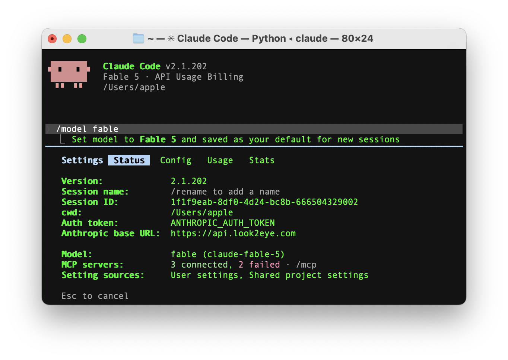

# Claude Code 配置

[Claude Code](https://claude.com/product/claude-code)  是 Anthropic 官方推出的 AI 编码 CLI 工具。通过 Look2Eye，你可以获得无限流量、更低延迟和多模型切换能力。

## 为什么使用 Look2Eye？

-   **高速率配额** — 默认高 RPM，TPM 不限，满足高频编码需求
-   **高可用** — 多节点冗余，自动故障切换
-   **低延迟** — 全球加速节点，自动最优路由
-   **完整协议支持** — 100% 兼容 Anthropic 原生协议

## 快速开始

  - [1. 安装 Claude Code](installation.md)
  - [2. 配置模型供应商](model-provider.md)
  - [3. CCometixLine 状态栏](contextline.md)
  - [4. 配置 Skills](skills.md)
