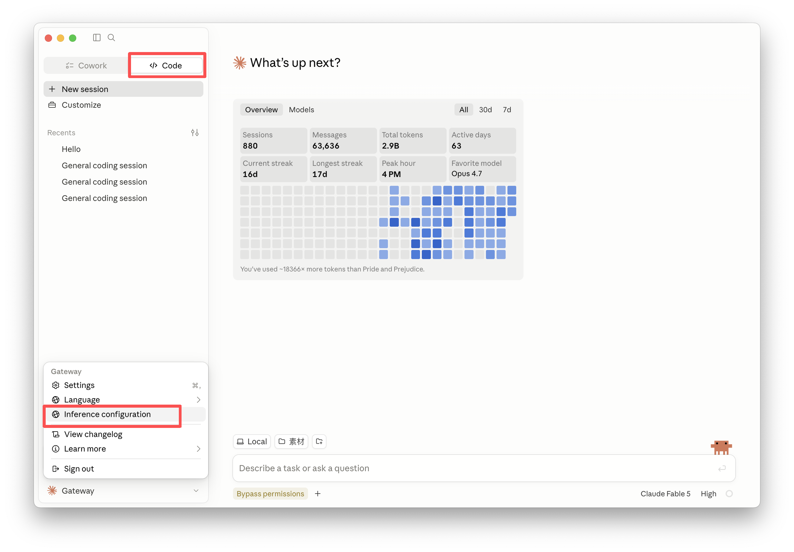
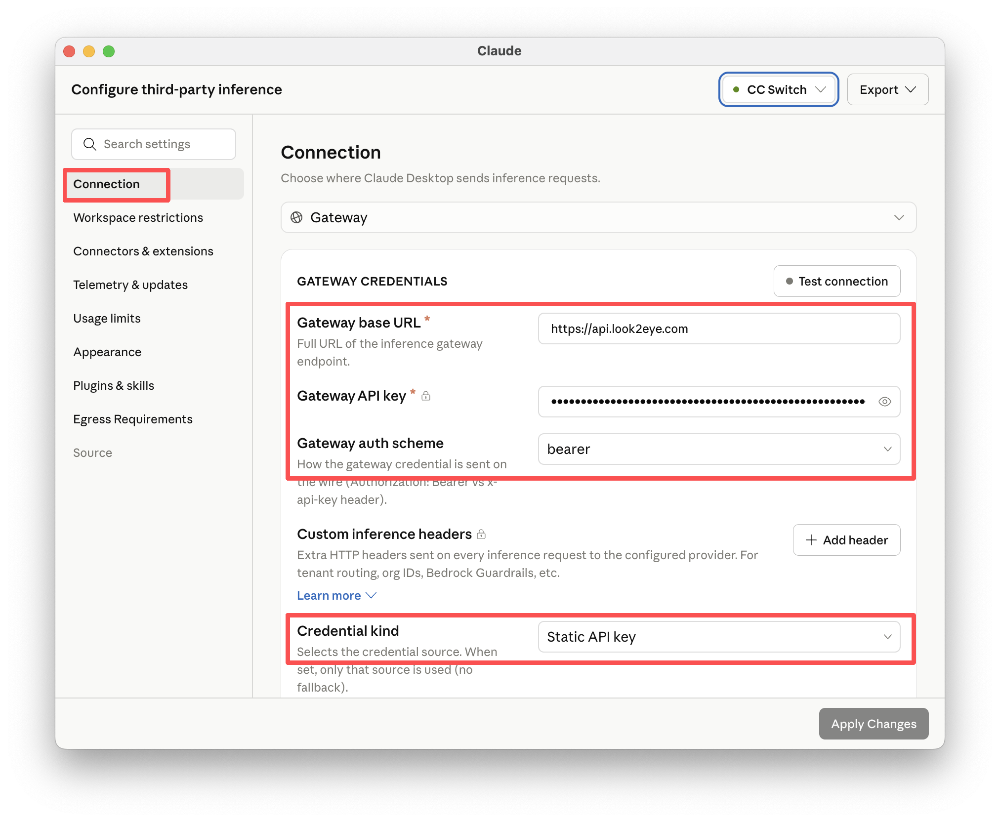
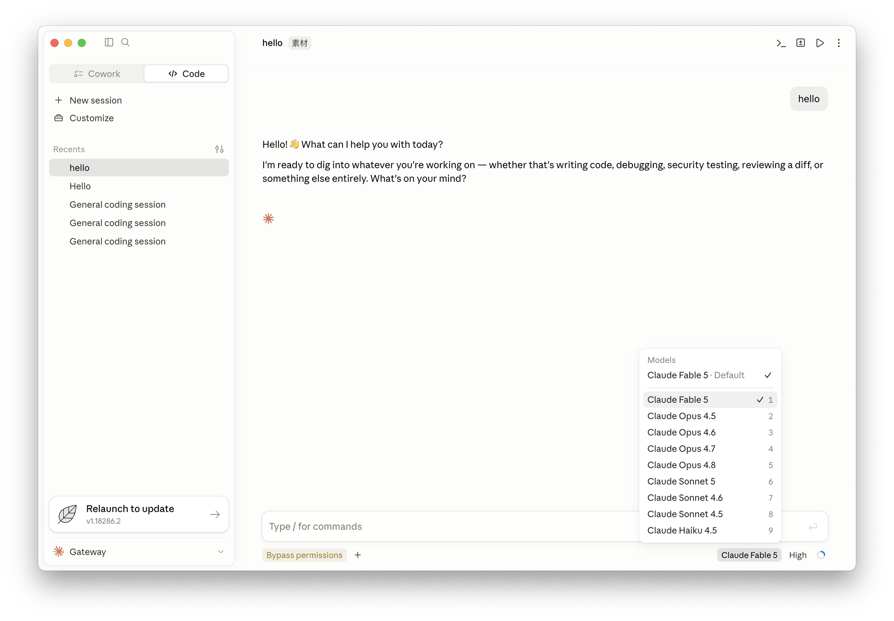

[Claude Desktop](https://claudecoworks.com) 是 Anthropic 官方桌面客户端，内置「第三方推理」功能，支持通过 Anthropic 兼容的 Gateway 将推理请求转发到 Look2Eye，从而访问全球顶级模型。

## 前提条件

- 已注册 Look2Eye 账号并获取 API Key（[前往获取](https://api.look2eye.com/keys)）
- 已安装 Claude 桌面版（[下载地址](https://claude.com)）

## 配置步骤
### 第 1 步：
安装并打开 claude 桌面版

### 第 2 步：打开第三方推理配置

在菜单栏点击 **Developer → Configure Third-Party Inference…**，打开配置面板。

### 第 3 步：选择 Gateway

在 **Connection** 页面选中 **Gateway（Anthropic-compatible）**。

### 第 4 步：填写凭据并应用

在 **GATEWAY CREDENTIALS** 区域填写以下信息，然后点击 **Apply locally**：

| 配置项 | 值                          |
| --- |----------------------------|
| Gateway base URL | `https://api.look2eye.com` |
| Gateway API key | 你的 Look2Eye API Key        |
| Gateway auth scheme | `bearer`                   |

右上角状态指示器变为绿色即表示已成功接入。

### 第 5 步：浏览可用模型

连接建立后，即可在 Claude Coworks 中查看所有可用模型。前往 [Look2Eye 可用渠道](https://api.look2eye.com/available-channels) 浏览完整的支持模型列表及其功能说明。

### 第 6 步：选择你的模型

在 Claude Coworks 界面中选取要使用的特定模型。你可以随时根据需求在不同模型之间切换。选定的模型将用于所有推理请求。

### 第 7 步：验证并开始使用

设置已完成！Claude Coworks 将通过 Look2Eye Gateway 以你选定的模型转发所有推理请求。现在即可正常使用 Claude Coworks，所有请求都将通过 Look2Eye 基础设施处理。

## 开始使用

配置生效后，Claude Coworks 的所有推理请求将通过 Look2Eye Gateway 转发。可前往 [Look2Eye 可用渠道](https://api.look2eye.com/available-channels) 查看支持的模型列表。

## 常见问题

**Q: 点击 Apply locally 后状态指示器未变绿 / 连接失败**

1. 确认 Gateway base URL 填写为 `https://api.look2eye.com`，末尾不加斜杠
2. 确认 Gateway auth scheme 选择的是 `bearer`
3. 确认 API Key 从 Look2Eye 控制台 完整复制，无多余空格
4. 确认网络连接正常
