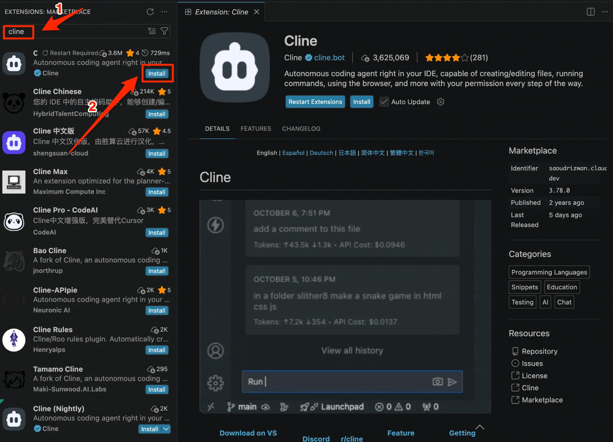
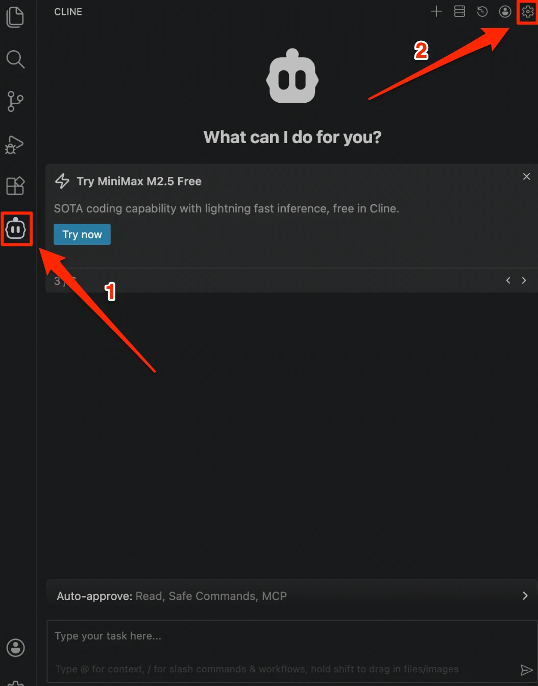
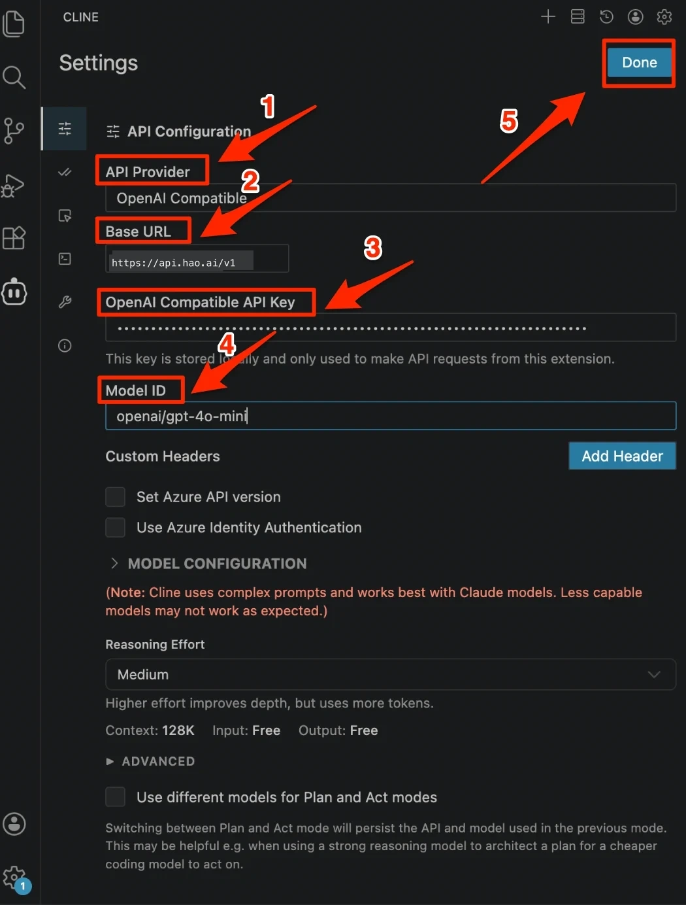

# Cline 配置

[Cline](https://github.com/cline/cline)  是一款流行的 VS Code AI 编码插件（前身为 Claude Dev）。通过 Look2Eye 接入，可以使用多种模型。

## 前提条件

-   已注册 Look2Eye 账号并获取 API Key（[前往获取](https://api.look2eye.com/console/api-keys) ）
-   已安装 [VS Code](https://code.visualstudio.com/)

## 配置步骤

### 第 1 步：安装 Cline

在 VS Code 扩展市场搜索 **Cline** 并安装。

### 第 2 步：打开设置

点击左侧活动栏的 **Cline 图标**，进入 Cline 面板，然后点击右上角的 **设置图标**。

### 第 3 步：填写配置并保存

在 API Configuration 页面填写以下信息，完成后点击右上角 **Done**：

| 配置项 | 值 |
| --- | --- |
| **API Provider** | `OpenAI Compatible` |
| **Base URL** | `https://api.api.look2eye.com/v1` |
| **OpenAI Compatible API Key** | 你的 Look2Eye API Key |
| **Model ID** | `openai/gpt-4.1`（或其他模型） |

> ℹ️ Cline 也支持 Anthropic 和 Gemini 协议，对应的 Base URL 分别为 `https://api.api.look2eye.com/anthropic` 和 `https://api.api.look2eye.com/gemini`。

## 推荐模型

推荐模型请参考 [模型广场](https://api.look2eye.com/models) 。

## 常见问题

**Q: 提示模型不支持**

确认 Model ID 格式正确，使用 OpenAI Compatible 时模型名需带 `厂商/` 前缀，如 `openai/gpt-4.1`。

**Q: 无法使用 Tool Use 功能**

切换 API Provider 为 Anthropic，Base URL 改为 `https://api.api.look2eye.com/anthropic`，可获得完整的 Tool Use 支持。
