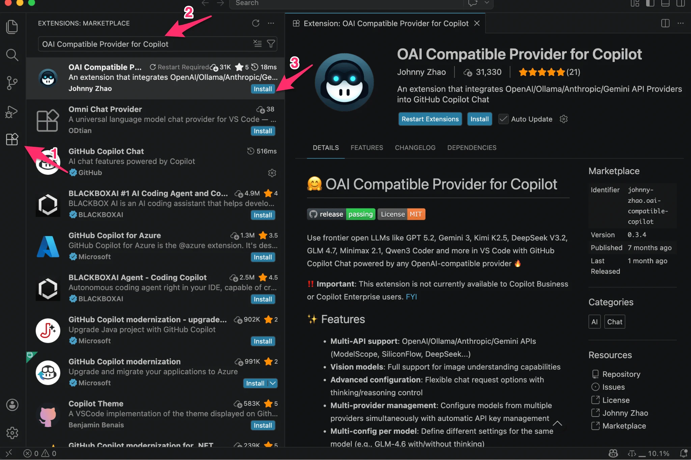
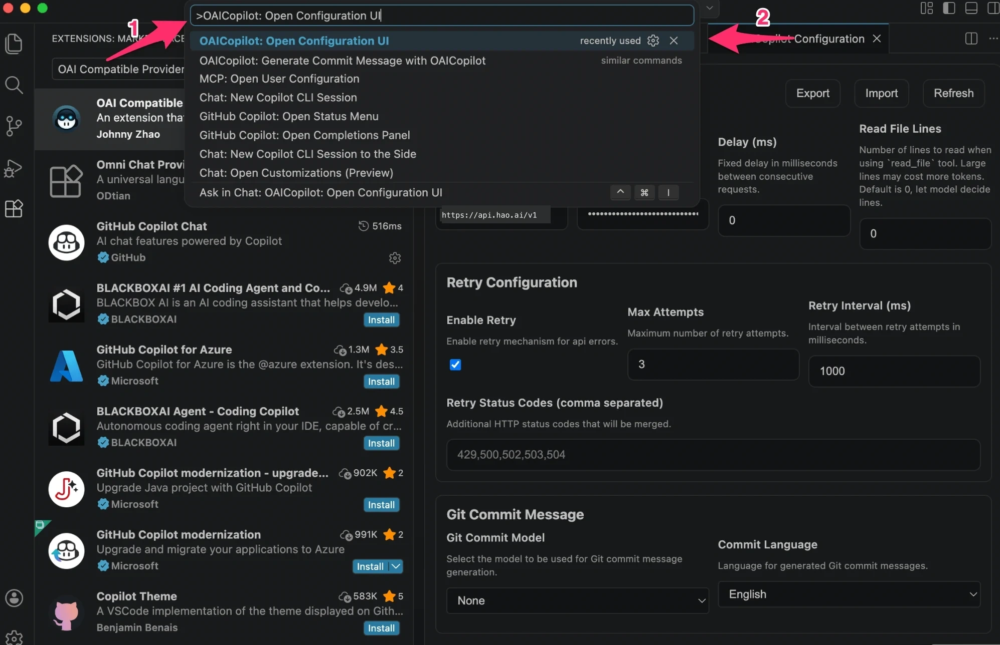
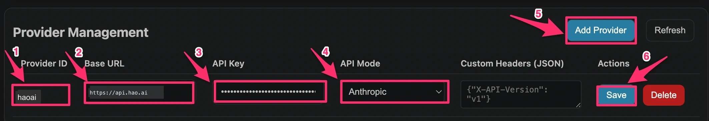
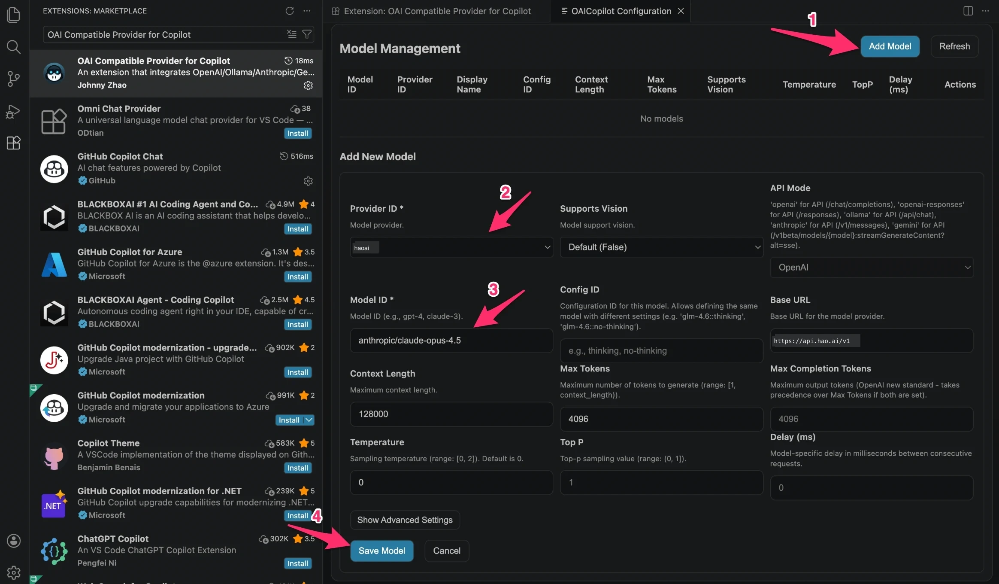
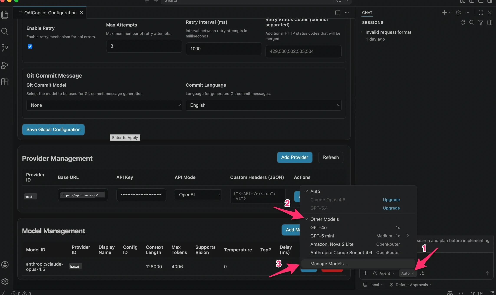
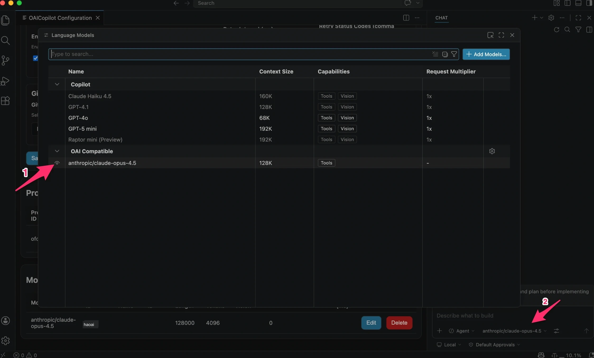

# GitHub Copilot 配置

通过 VS Code 扩展 **OAI Compatible Provider for Copilot**，可以将 Look2Eye 接入 GitHub Copilot Chat，在熟悉的编辑器中使用 Claude、GPT-4o、Gemini 等全球顶级模型。

> ⚠️ 本扩展需要 **GitHub Copilot 个人版（Individual）订阅**，暂不支持 Copilot Business 和 Enterprise 用户。若无 Copilot 订阅，建议改用 [Cursor](cursor.md) 或 [Cherry Studio](cherry-studio.md)。

## 前提条件

-   已注册 Look2Eye 账号并获取 API Key（[前往获取](https://api.look2eye.com/keys) ）
-   已安装 [VS Code](https://code.visualstudio.com/)
-   已有有效的 **GitHub Copilot 个人版（Individual）** 订阅（不支持 Business / Enterprise）

## 配置步骤

### 第 1 步：安装扩展

在 VS Code 扩展市场搜索 **OAI Compatible Provider for Copilot**（作者：Johnny Zhao），点击 **Install** 安装。



### 第 2 步：打开配置界面

按 `Cmd+Shift+P`（macOS）/ `Ctrl+Shift+P`（Windows/Linux）打开命令面板，输入并执行：

```text
OAICopilot: Open Configuration UI
```



### 第 3 步：填写全局配置

在 **Global Configuration** 区域填写以下内容，然后点击 **Save Global Configuration** 保存：

| 配置项 | 值 |
| --- | --- |
| **Global Base URL** | `https://api.look2eye.com` |
| **Global API Key** | 你的 Look2Eye API Key |


### 第 4 步：添加 Provider

在 **Provider Management** 区域，点击 **Add Provider**（标注 ①），在新建行中填写以下字段，然后点击 **Save**（标注 ⑥）：

| 字段 | 值 |
| --- | --- |
| **Provider ID**（标注 ②） | `look2eye` |
| **Base URL**（标注 ③） | `https://api.look2eye.com` |
| **API Key**（标注 ④） | 你的 Look2Eye API Key |
| **API Mode**（标注 ⑤） | `Anthropic` |



### 第 5 步：添加模型

在 **Model Management** 区域，点击 **Add Model**（标注 ①），填写以下字段，然后点击 **Save Model**（标注 ④）：

| 字段 | 值 |
| --- | --- |
| **Provider ID**（标注 ②） | `look2eye` |
| **Model ID**（标注 ③） | 模型名称，如 `anthropic/claude-opus-4.5` |



可重复此步骤添加多个模型，模型 ID 请参考 [Look2Eye 可用渠道](https://api.look2eye.com/available-channels) 。

### 第 6 步：在聊天面板选择模型

打开 Copilot Chat 面板，点击模型选择区域，关闭 **Auto** 模式，在 **Other Models** 下找到刚添加的 Look2Eye 模型并选中。

若看不到模型，点击 **Manage Models…** 进入模型列表页面。



### 第 7 步：确认模型并开始使用

在 Language Models 面板中，**OAI Compatible** 分组下会显示已添加的 Look2Eye 模型。在右下角聊天框选中模型后即可开始对话。



## 推荐模型

推荐模型请参考 [模型广场](https://api.look2eye.com/models) 。

## 常见问题

**Q: 扩展市场搜不到该扩展**

搜索完整名称 `OAI Compatible Provider for Copilot`，或直接搜索作者名 `Johnny Zhao`。

**Q: 命令面板找不到 `OAICopilot: Open Configuration UI`**

确认扩展已安装并启用，安装后可能需要重新加载 VS Code 窗口（`Cmd+Shift+P` → `Reload Window`）。

**Q: 添加的模型在聊天面板看不到**

在模型选择下拉中关闭 **Auto** 模式，切换到 **Other Models** 分类下查找，或点击 **Manage Models…** 检查模型是否已正确添加。

**Q: 提示「Invalid API Key」或请求失败**

检查以下几点：

1.  Global Base URL 是否为 `https://api.look2eye.com/v1`（末尾不加斜杠）
2.  API Key 是否从 [Look2Eye 控制台](https://api.look2eye.com/keys)  完整复制（无前后空格）
3.  Provider 的 API Mode 是否选择了 `Anthropic`

**Q: 代码补全（Tab 补全）仍使用 Copilot 官方模型**

这是预期行为。OAI Compatible Provider 目前仅影响 **Copilot Chat** 对话功能，Tab 代码补全由 GitHub Copilot 官方控制。

**Q: 我是 Copilot Business / Enterprise 用户，能用吗？**

暂不支持。该扩展目前仅适用于 **GitHub Copilot 个人版（Individual）** 用户，Business 和 Enterprise 用户需等待后续版本支持。
