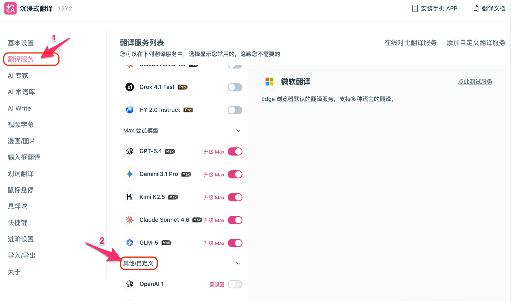
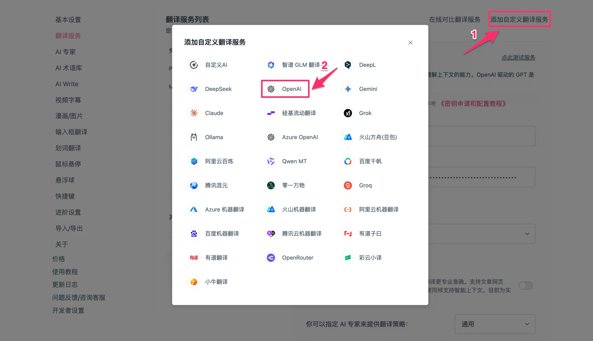
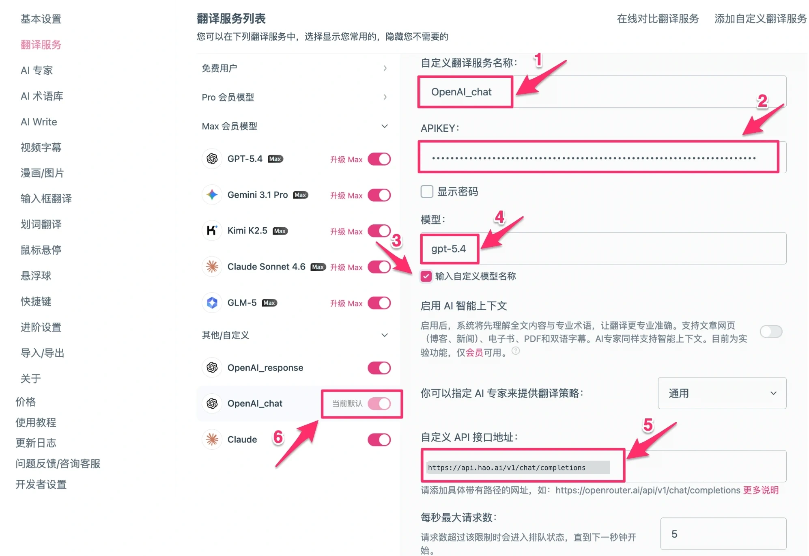
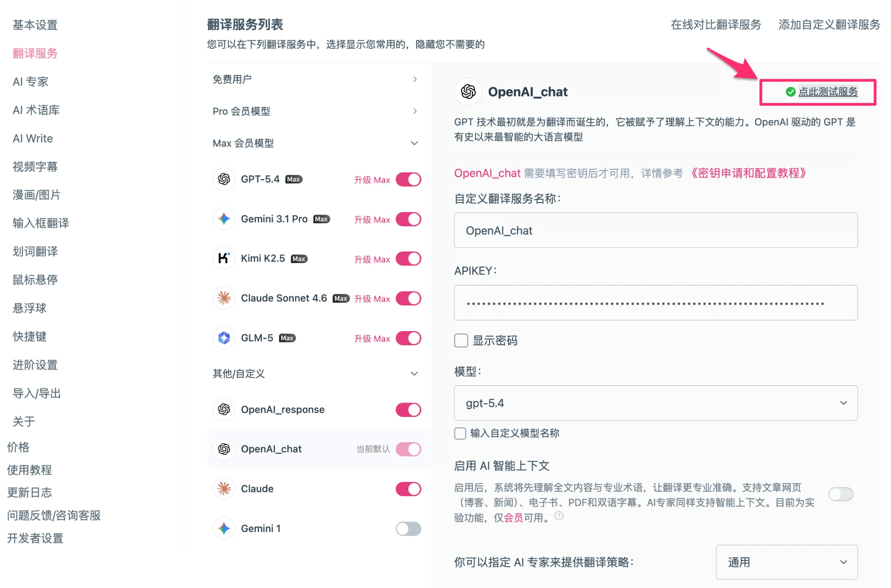
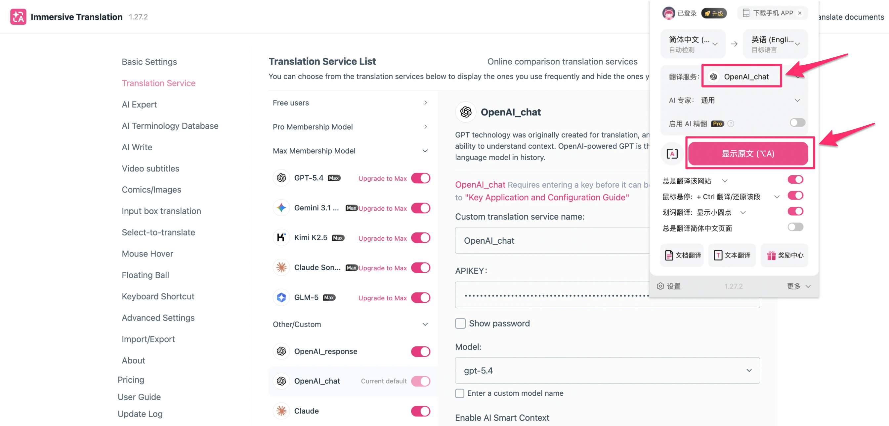

# 沉浸式翻译配置

[沉浸式翻译](https://immersivetranslate.com)  是一款广受欢迎的浏览器翻译插件，支持双语对照显示，可翻译网页、PDF、字幕、输入框等内容，支持 Chrome、Firefox、Safari 等主流浏览器。

通过配置 Look2Eye 作为翻译服务，你可以使用 GPT、Claude、Gemini、DeepSeek 等全球顶级模型进行翻译，只需一个 API Key。

## 前提条件

-   已注册 Look2Eye 账号并获取 API Key（[前往获取](https://api.look2eye.com/console/api-keys) ）
-   已安装沉浸式翻译插件（[下载地址](https://immersivetranslate.com) ）

## 支持的协议

沉浸式翻译支持以下三种协议接入 Look2Eye：

| 协议 | 配置方式 | 自定义接口地址 | 适用模型 |
| --- | --- | --- | --- |
| **OpenAI Chat** | 自定义翻译服务 | `https://api.api.look2eye.com/v1/chat/completions` | 所有模型 |
| **OpenAI Response** | 自定义翻译服务 | `https://api.api.look2eye.com/v1/responses` | 所有模型 |
| **Claude** | 内置 Claude 服务商 | `https://api.api.look2eye.com/anthropic` | Claude 系列 |
| **Gemini（通过 OpenAI Chat）** | 自定义翻译服务 | `https://api.api.look2eye.com/v1/chat/completions` | Gemini 系列 |

> ℹ️ 沉浸式翻译内置的 Gemini 服务商使用 `x-goog-api-key` 认证头，与 Look2Eye 的 `Authorization: Bearer` 认证方式不兼容，因此无法直接使用内置 Gemini 服务商接入 Look2Eye。如需使用 Gemini 模型，请通过 OpenAI Chat 自定义服务，在自定义模型名中填写 Gemini 模型名称（如 `google/gemini-3.1-flash-lite-preview`、`google/gemini-3.1-pro-preview` 等）即可。

## 配置步骤

### 第 1 步：打开翻译服务设置

点击浏览器工具栏的沉浸式翻译图标，进入设置页面后点击顶部的**翻译服务**标签。

### 第 2 步：找到自定义服务入口

在翻译服务页面，向下滚动找到**其他/自定义**分组。

点击右上角**添加自定义翻译服务**按钮。

### 第 3 步：填写配置信息

根据你想使用的协议，填写对应的配置：

**OpenAI Chat（支持所有模型，包括 Gemini）**

| 配置项 | 值 |
| --- | --- |
| **自定义翻译服务名称** | `look2eye`（或任意名称） |
| **自定义 API 接口地址** | `https://api.api.look2eye.com/v1/chat/completions` |
| **APIKEY** | 你的 Look2Eye API Key |
| **模型** | 勾选「输入自定义模型名称」，填写模型名，例如 `openai/gpt-4.1` |

**OpenAI Response**

| 配置项 | 值 |
| --- | --- |
| **自定义翻译服务名称** | `look2eye-response`（或任意名称） |
| **自定义 API 接口地址** | `https://api.api.look2eye.com/v1/responses` |
| **APIKEY** | 你的 Look2Eye API Key |
| **模型** | 勾选「输入自定义模型名称」，填写模型名，例如 `openai/gpt-4.1` |

**Claude（Anthropic 原生协议）**

使用内置的 **Claude** 服务商，无需添加自定义服务：

| 配置项 | 值 |
| --- | --- |
| **APIKEY** | 你的 Look2Eye API Key |
| **自定义 API 接口地址** | `https://api.api.look2eye.com/anthropic` |
| **模型** | 勾选「输入自定义模型名称」，填写 `claude-sonnet-4.6` |

填写完成后点击**点此测试服务**，通过后点击**保存**。

### 第 4 步：设为默认并开始翻译

在翻译服务列表中，点击你刚配置的服务旁边的开关将其设为**当前默认**，然后打开任意网页，按 `Alt + A`（Mac 用 `Option + A`）即可翻译。

## 翻译效果

配置完成后，网页会显示原文与译文双语对照。

## 可用模型示例

推荐模型请参考 [Look2Eye 模型广场](https://api.look2eye.com/models) 。

## 常见问题

**Q: 测试服务时报错 `String contains non ISO-8859-1 code point`**

API Key 中包含了非 ASCII 字符（如全角空格、中文字符）。请重新从 [Look2Eye 控制台](https://api.look2eye.com/console/api-keys)  复制 API Key，确保没有多余字符。

**Q: 内置 Gemini 服务商能接入 Look2Eye 吗？**

不能。沉浸式翻译内置的 Gemini 服务商使用 `x-goog-api-key` 认证头，与 Look2Eye 的 `Authorization: Bearer` 认证方式不兼容。如需使用 Gemini 模型，请通过 OpenAI Chat 自定义服务，在自定义模型名中填写 Gemini 模型名称（如 `google/gemini-3.1-flash-lite-preview`、`google/gemini-3.1-pro-preview` 等）。

**Q: 如何切换不同的翻译服务？**

在**翻译服务**页面，点击对应服务旁边的开关即可切换为当前默认服务。
