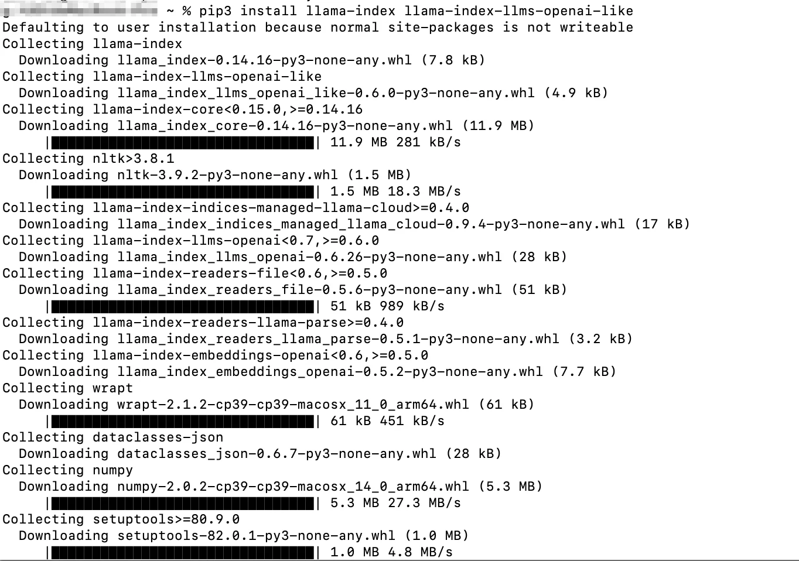

# LlamaIndex 配置

[LlamaIndex](https://www.llamaindex.ai)  是一个用于构建 LLM 应用的数据框架，专注于 RAG（检索增强生成）和 AI Agent 场景。由于 Look2Eye 完全兼容 OpenAI 协议，只需修改 `api_base` 即可接入。

## 前提条件

-   已注册 Look2Eye 账号并获取 API Key（[前往获取](https://api.look2eye.com/console/api-keys) ）
-   已安装 Python 3.10+

## 配置步骤

### 第 1 步：安装依赖

```bash
pip3 install llama-index llama-index-llms-openai-like
```



### 第 2 步：配置并运行

创建文件 `test_llamaindex.py`：

```python filename="test_llamaindex.py"
from llama_index.llms.openai_like import OpenAILike

llm = OpenAILike(
    model="openai/gpt-4.1",
    api_base="https://api.api.look2eye.com/v1",
    api_key="<你的 LOOK2EYE_API_KEY>",
    is_chat_model=True
)

response = llm.complete("你好，介绍一下自己")
print(response)
```

运行：

```bash
python3 -W ignore test_llamaindex.py
```


## 可用模型示例

推荐模型请参考 [Look2Eye 模型广场](https://api.look2eye.com/models) 。

> ℹ️ LlamaIndex 的具体 API 可能随版本更新变化，请参考 [LlamaIndex 官方文档](https://docs.llamaindex.ai) 。

## 常见问题

**Q: 提示 `ModuleNotFoundError: No module named 'llama_index'`**

运行 `pip3 install llama-index llama-index-llms-openai-like` 安装依赖。

**Q: 提示 `TypeError: unsupported operand type(s) for |`**

Python 版本过低，需要升级到 Python 3.10 或以上版本。

**Q: 提示 API Key 无效**

确认 `api_key` 填写的是 Look2Eye 的 API Key，可在 [Look2Eye 控制台](https://api.look2eye.com/console/api-keys)  获取。
