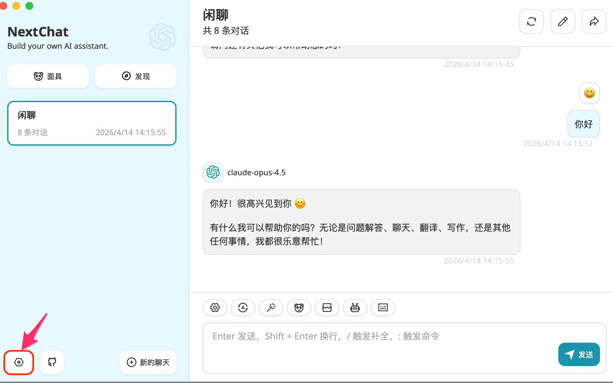
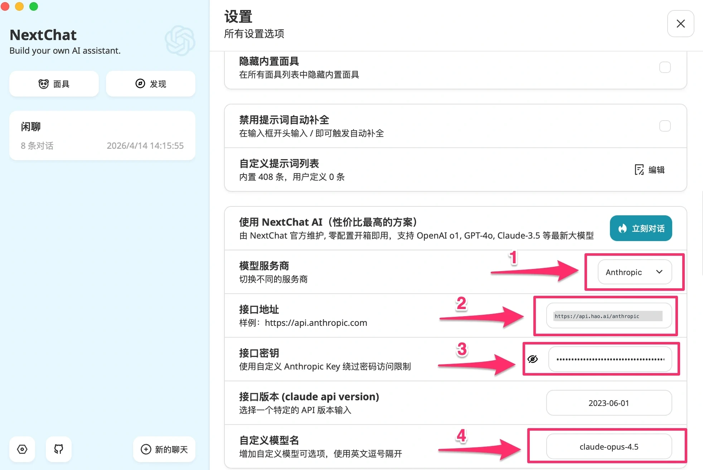
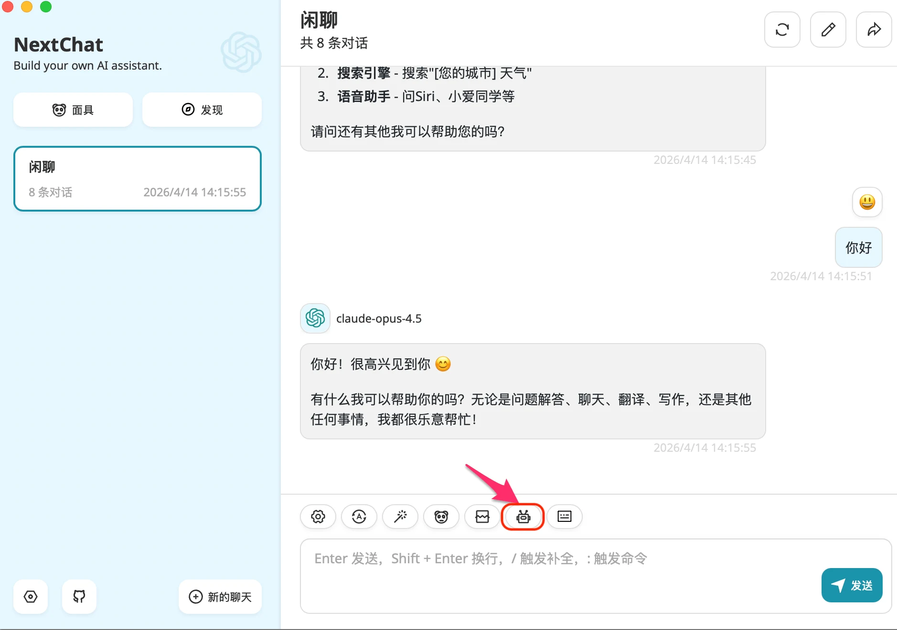
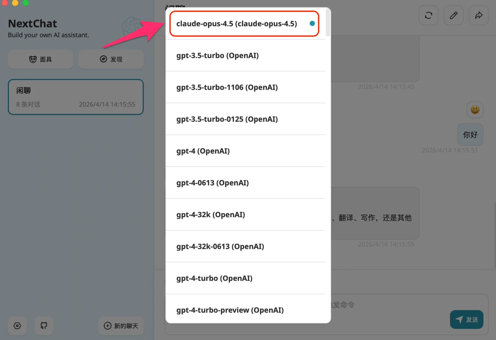
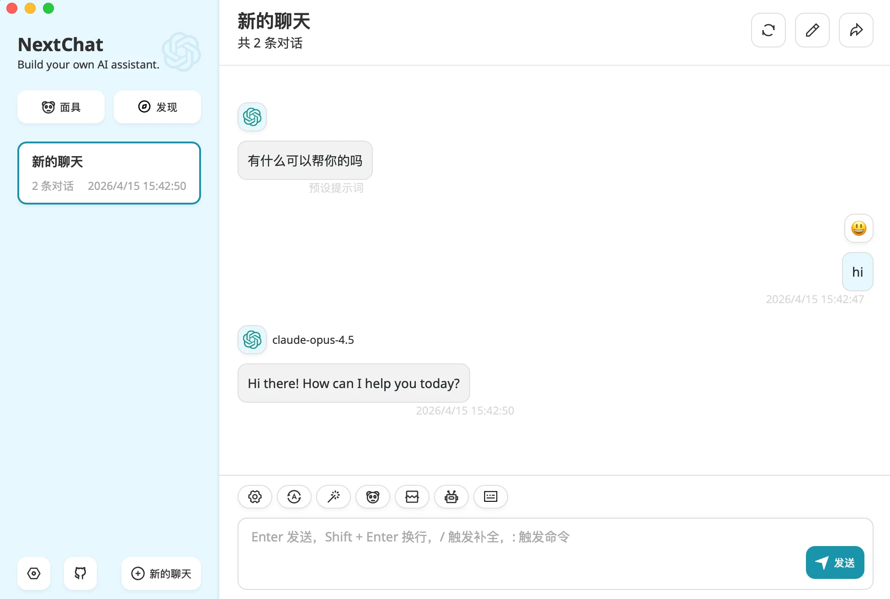

# NextChat 配置

[NextChat](https://nextchat.dev) （原 ChatGPT-Next-Web）是一款广受欢迎的开源 AI 客户端，支持 Web、桌面（macOS、Windows、Linux）多平台部署，界面简洁，功能丰富，支持多种 AI 服务商配置。

通过配置 Look2Eye 作为服务商，你可以在 NextChat 中使用 GPT、Claude、Gemini 等全球顶级模型，只需一个 API Key。

NextChat 支持以下三种协议接入 Look2Eye：

| 协议 | 模型服务商 | 接口地址 | 适用模型 |
| --- | --- | --- | --- |
| **OpenAI Chat** | OpenAI | `https://api.api.look2eye.com` | 所有模型（带 `厂商/` 前缀） |
| **Anthropic** | Anthropic | `https://api.api.look2eye.com/anthropic` | Claude 系列 |
| **Google Gemini** | Google | `https://api.api.look2eye.com/gemini` | Gemini 系列 |

## 前提条件

-   已注册 Look2Eye 账号并获取 API Key（[前往获取](https://api.look2eye.com/console/api-keys) ）
-   已安装 NextChat（[下载地址](https://nextchat.dev) ）或使用 Web 版

## 配置步骤

### 第 1 步：打开设置

启动 NextChat，点击左下角的 **设置** 图标。

### 第 2 步：配置模型服务商和 API Key

在设置页面中，找到 **模型服务商** 下拉菜单，选择对应服务商，填写接口地址和 API Key。

根据你选择的服务商，填写对应的配置：

**OpenAI（支持所有模型）**

| 配置项 | 值 |
| --- | --- |
| **模型服务商** | OpenAI |
| **接口地址** | `https://api.api.look2eye.com` |
| **API Key** | 你的 Look2Eye API Key |
| **自定义模型名** | 例如 `openai/gpt-5.3-chat,anthropic/claude-sonnet-4.6,deepseek/deepseek-v3.2` |

**Anthropic（Claude 系列）**

| 配置项 | 值 |
| --- | --- |
| **模型服务商** | Anthropic |
| **接口地址** | `https://api.api.look2eye.com/anthropic` |
| **API Key** | 你的 Look2Eye API Key |
| **自定义模型名** | 例如 `claude-sonnet-4.6,claude-opus-4.6,claude-haiku-4.5` |

**Google（Gemini 系列）**

| 配置项 | 值 |
| --- | --- |
| **模型服务商** | Google |
| **终端地址** | `https://api.api.look2eye.com/gemini` |
| **API Key** | 你的 Look2Eye API Key |
| **自定义模型名** | 例如 `google/gemini-3.1-pro-preview,google/gemini-3.1-flash-lite-preview` |

> ℹ️ **自定义模型名** 字段支持同时填写多个模型，用英文逗号隔开。填写后这些模型会出现在「模型 (model)」下拉列表中供你选择。

> ⚠️ 使用 OpenAI 服务商时，接口地址填 `https://api.api.look2eye.com`（不含 `/v1`），NextChat 会自动补全完整路径。若填写 `https://api.api.look2eye.com/v1` 会导致路径重复报错。

### 第 3 步：选择模型

配置完成后，在设置页面底部的 **模型 (model)** 下拉框中，可以看到你刚填写的自定义模型。

点击下拉框，可以看到所有可用的服务商和模型列表。

## 开始使用

关闭设置，回到主界面，选好模型后即可开始对话。

## 可用模型示例

推荐模型请参考 [Look2Eye 模型广场](https://api.look2eye.com/models) 。

## 常见问题

**Q: 报错 `No providers support endpoint 'chat_completions'`**

模型名填写有误，该模型不存在或你的账号无权访问。请检查模型名是否正确，或换一个其他模型测试。

**Q: 报错 `Unsupported OpenAI API endpoint`**

接口地址填写了 `https://api.api.look2eye.com/v1`，导致路径重复。请改为 `https://api.api.look2eye.com`（不含 `/v1`）。

**Q: OpenAI 服务商可以调用 Claude 和 Gemini 模型吗？**

可以。在自定义模型名中填写带厂商前缀的完整模型名（如 `anthropic/claude-sonnet-4.6`），Look2Eye 会自动路由到对应厂商。

**Q: Anthropic 和 Google 服务商的模型名需要带前缀吗？**

不需要。使用 Anthropic 服务商时，模型名直接填 `claude-sonnet-4.6`；使用 Google 服务商时，填 `google/gemini-3.1-pro-preview`（需要带 `google/` 前缀）。
