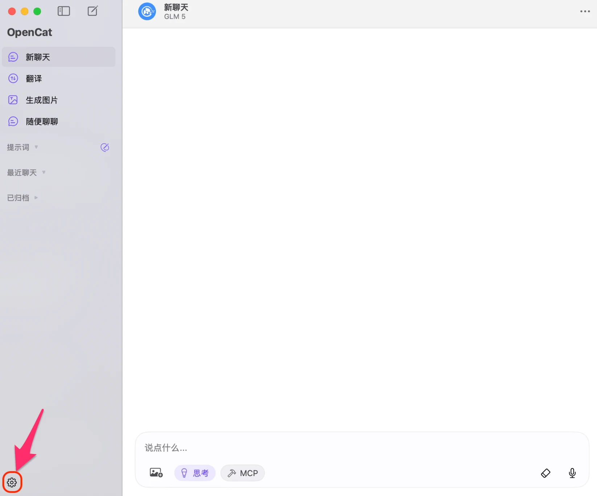
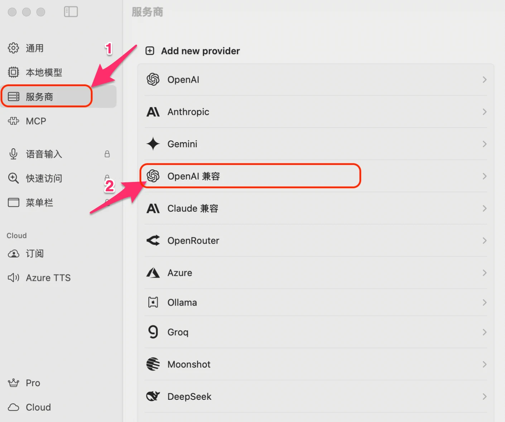
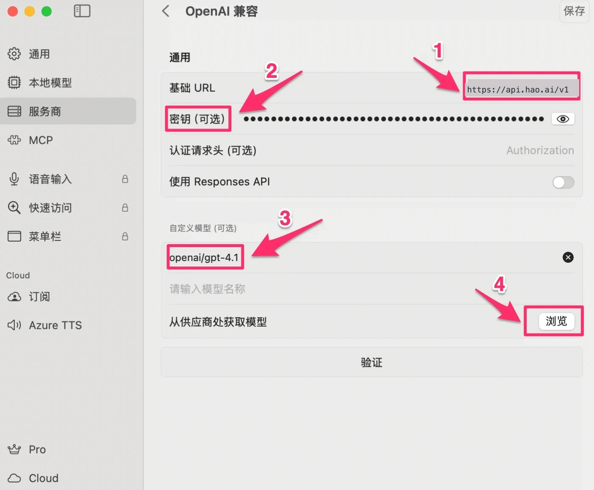
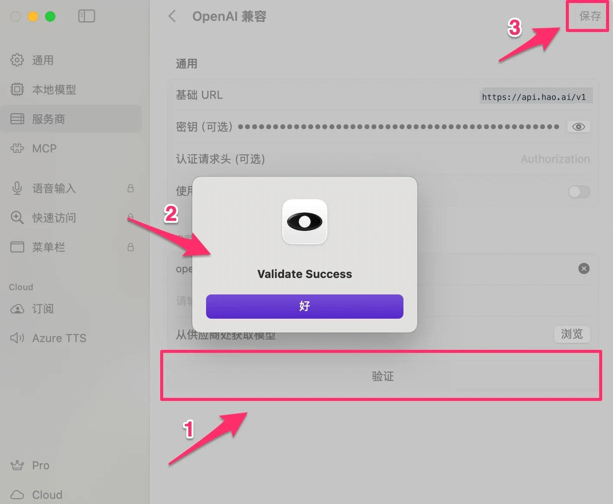
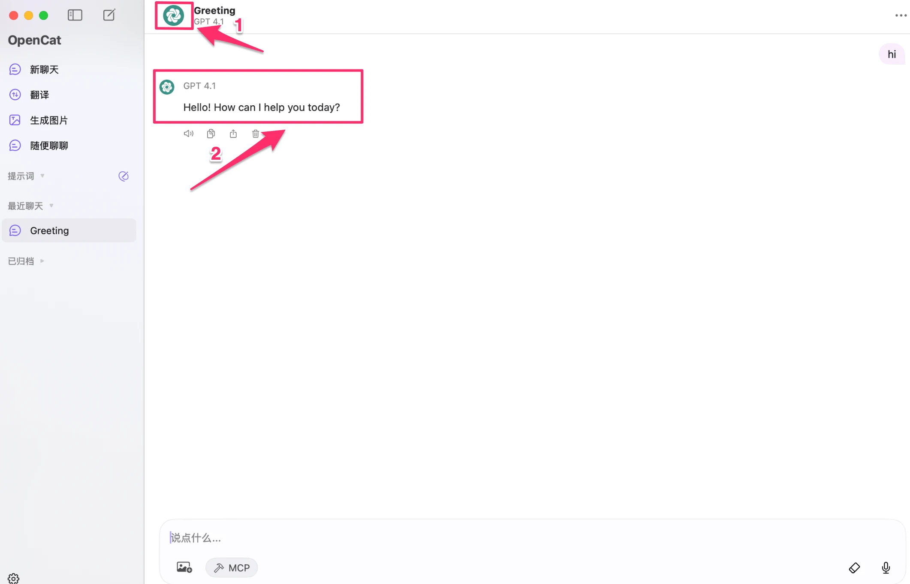

# OpenCat 配置

[OpenCat](https://opencat.app)  是一款界面简洁、体验流畅的 AI 客户端（支持 macOS、iOS），专为日常 AI 对话场景设计，支持自定义 API 服务商、多模型切换和对话历史管理。

通过配置 Look2Eye 作为服务商，你可以在 OpenCat 中使用 GPT、Claude、Gemini、DeepSeek 等全球顶级模型，只需一个 API Key。

## 前提条件

-   已注册 Look2Eye 账号并获取 API Key（[前往获取](https://api.look2eye.com/keys) ）
-   已安装 OpenCat（[下载地址](https://opencat.app) ）

## 配置步骤

### 第 1 步：打开设置

启动 OpenCat，点击左下角的 **设置** 图标。

### 第 2 步：进入服务商，选择 OpenAI 兼容

点击左侧 **服务商**，在列表中找到并点击 **OpenAI 兼容**。

> ℹ️ 请选择 **OpenAI 兼容**，而不是列表中的 OpenAI 原生选项。OpenAI 原生会尝试从 OpenAI 官方拉取模型列表，与 Look2Eye 的模型格式不兼容。

### 第 3 步：填写配置信息

填写以下信息：

| 配置项 | 值 |
| --- | --- |
| **基础 URL** | `https://api.look2eye.com/v1` |
| **密钥** | 你的 Look2Eye API Key |
| **自定义模型** | 手动输入模型名，例如 `openai/gpt-4.1` |

> ℹ️ 自定义模型需使用 `厂商/模型名` 格式。你可以一次添加多个模型，方便在对话中随时切换。

### 第 4 步：验证并保存

点击 **验证** 按钮，看到「**Validate Success**」即表示配置成功，然后点击右上角 **保存**。

## 开始使用

配置完成后，回到主界面即可开始对话，顶部会显示当前使用的模型名称。

## 可用模型示例

推荐模型请参考 [Look2Eye 可用渠道](https://api.look2eye.com/available-channels) 。

## 常见问题

**Q: 验证提示失败**

1.  确认基础 URL 填写的是 `https://api.look2eye.com/v1`（末尾不加斜杠）
2.  确认 API Key 从 [Look2Eye 控制台](https://api.look2eye.com/keys)  完整复制，无多余空格
3.  确认网络连接正常

**Q: 为什么不能用 OpenAI 原生，只能用 OpenAI 兼容？**

OpenCat 的 OpenAI 原生服务商会自动调用 `/v1/models` 接口拉取模型列表，但 Look2Eye 返回的模型名带有 `openai/` 等厂商前缀，OpenCat 无法识别。使用 **OpenAI 兼容** 并手动填写模型名可以绕过这个问题。

**Q: 可以同时添加多个模型吗？**

可以，在「自定义模型」处逐行输入多个模型名称，保存后即可在对话界面切换使用。
